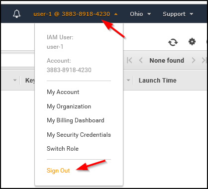
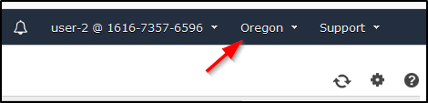
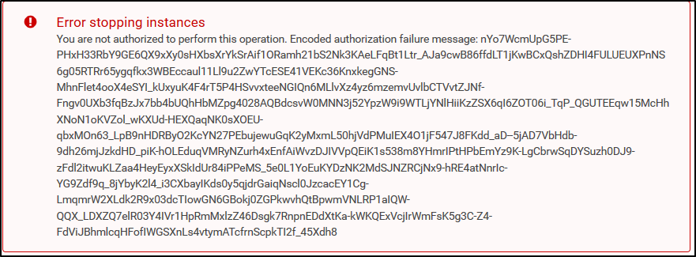
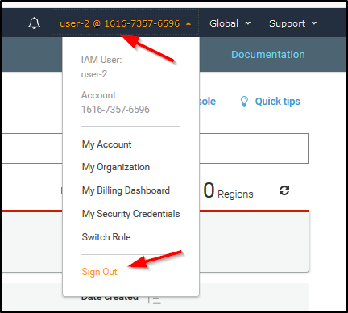

Introduction to AWS Identity and Access Management (IAM)
========================================================

- Lab Overview
- Topics covered
- Task 1: Explore the Users and Groups
- Task 2: Add Users to Groups
- Task 3: Sign-In and Test Users
- End Lab
- Conclusion

Lab Overview
------------

**AWS Identity and Access Management (IAM)** is a web service that enables Amazon Web Services (AWS) customers to manage users and user permissions in AWS. With IAM, you can centrally manage **users**, **security credentials** such as access keys, and **permissions** that control which AWS resources users can access.

Topics covered
--------------

This lab will demonstrate:

-   Exploring pre-created **IAM Users and Groups**
-   Inspecting **IAM policies** as applied to the pre-created groups
-   Following a **real-world scenario**, adding users to groups with specific capabilities enabled
-   Locating and using the **IAM sign-in URL**
-   **Experimenting** with the effects of policies on service access

**Other AWS Services**

During this lab, you may receive error messages when performing actions beyond the steps in this lab guide. These messages will not impact your ability to complete the lab.

**AWS Identity and Access Management**

AWS Identity and Access Management (IAM) can be used to:

-   **Manage IAM Users and their access:** You can create Users and assign them individual security credentials (access keys, passwords, and multi-factor authentication devices). You can manage permissions to control which operations a User can perform.

-   **Manage IAM Roles and their permissions:** An IAM Role is similar to a User, in that it is an AWS identity with permission policies that determine what the identity can and cannot do in AWS. However, instead of being uniquely associated with one person, a Role is intended to be *assumable* by anyone who needs it.

-   **Manage federated users and their permissions:** You can enable *identity federation* to allow existing users in your enterprise to access the AWS Management Console, to call AWS APIs and to access resources, without the need to create an IAM User for each identity.

Start Lab
---------

-   Open https://808477742599.signin.aws.amazon.com/console
-   Enter login credentials

Task 1: Explore the Users and Groups
------------------------------------

In this task, you will explore the Users and Groups that have already been created for you in IAM.

1.  In the **AWS Management Console**, on the **Services** menu, click **IAM**.

2.  In the navigation pane on the left, click **Users**.

The following IAM Users have been created for you:

-   user-1
-   user-2
-   user-3

There are also other users, which you can ignore for this lab.

1.  Click **user-1**.

This will bring to a summary page for user-1. The **Permissions** tab will be displayed.

1.  Notice that user-1 does not have any permissions.

2.  Click the **Groups** tab.

user-1 also is not a member of any groups.

1.  Click the **Security credentials** tab.

user-1 is assigned a **Console password**

1.  In the navigation pane on the left, click **Groups**.

The following groups have already been created for you:

-   EC2-Admin
-   EC2-Support
-   S3-Support

1.  Click the **EC2-Support** group.

This will bring you to the summary page for the **EC2-Support** group.

1.  Click the **Permissions** tab.

This group has a Managed Policy associated with it, called **AmazonEC2ReadOnlyAccess**. Managed Policies are pre-built policies (built either by AWS or by your administrators) that can be attached to IAM Users and Groups. When the policy is updated, the changes to the policy are immediately apply against all Users and Groups that are attached to the policy.

1.  Under **Actions**, click the **Show Policy** link.

A policy defines what actions are allowed or denied for specific AWS resources. This policy is granting permission to List and Describe information about EC2, Elastic Load Balancing, CloudWatch and Auto Scaling. This ability to view resources, but not modify them, is ideal for assigning to a Support role.

The basic structure of the statements in an IAM Policy is:

-   **Effect** says whether to *Allow* or *Deny* the permissions.
-   **Action** specifies the API calls that can be made against an AWS Service (eg *cloudwatch:ListMetrics*).
-   **Resource** defines the scope of entities covered by the policy rule (eg a specific Amazon S3 bucket or Amazon EC2 instance, or \* which means *any resource*).

1.  Close ** the **Show Policy** window.

2.  In the navigation pane on the left, click **Groups**.

3.  Click the **S3-Support** group.

The S3-Support group has the **AmazonS3ReadOnlyAccess** policy attached.

1.  Below the **Actions** menu, click the **Show Policy** link.

This policy has permissions to Get and List resources in Amazon S3.

1.  Close ** the **Show Policy** window.

2.  In the navigation pane on the left, click **Groups**.

3.  Click the **EC2-Admin** group.

This Group is slightly different from the other two. Instead of a *Managed Policy*, it has an **Inline Policy**, which is a policy assigned to just one User or Group. Inline Policies are typically used to apply permissions for one-off situations.

1.  Under **Actions**, click **Edit Policy** to view the policy.

This policy grants permission to view (Describe) information about Amazon EC2 and also the ability to Start and Stop instances.

2.  At the bottom of the screen, click **Cancel** to close the policy.

Business Scenario
-----------------

For the remainder of this lab, you will work with these Users and Groups to enable permissions supporting the following business scenario:

Your company is growing its use of Amazon Web Services, and is using many Amazon EC2 instances and a great deal of Amazon S3 storage. You wish to give access to new staff depending upon their job function:

User In | Group | Permissions
--- | --- | ---
`user-1` | S3-Support | Read-Only access to Amazon S3
`user-2` | EC2-Support  | Read-Only access to Amazon EC2
`user-3` | EC2-Admin | View, Start and Stop Amazon EC2 instances

Task 2: Add Users to Groups
---------------------------

You have recently hired **user-1** into a role where they will provide support for Amazon S3. You will add them to the **S3-Support** group so that they inherit the necessary permissions via the attached *AmazonS3ReadOnlyAccess* policy.

** You can ignore any "not authorized" errors that appear during this task. They are caused by your lab account having limited permissions and will not impact your ability to complete the lab.

**Add user-1 to the S3-Support Group**

1.  In the left navigation pane, click **Groups**.

2.  Click the **S3-Support** group.

3.  Click the **Users** tab.

4.  In the **Users** tab, click **Add Users to Group**.

5.  In the **Add Users to Group** window, configure the following:

-   Select **user-1**.
-   At the bottom of the screen, click **Add Users**.

In the **Users** tab you will see that user-1 has been added to the group.

**Add user-2 to the EC2-Support Group**

You have hired **user-2** into a role where they will provide support for Amazon EC2.

1.  Using similar steps to the ones above, add **user-2** to the **EC2-Support** group.

user-2 should now be part of the **EC2-Support** group.

**Add user-3 to the EC2-Admin Group**

You have hired **user-3** as your Amazon EC2 administrator, who manage your EC2 instances.

1.  Using similar steps to the ones above, add **user-3** to the **EC2-Admin** group.

user-3 should now be part of the **EC2-Admin** group.

1.  In the navigation pane on the left, click **Groups**.

Each Group should have a **1** in the Users column for the number of Users in each Group.

If you do not have a **1** beside each group, revisit the above instructions above to ensure that each user is assigned to a Group, as shown in the table in the Business Scenario section.

Task 3: Sign-In and Test Users
------------------------------

In this task, you will test the permissions of each IAM User.

1.  In the navigation pane on the left, click **Dashboard**.

An **IAM users sign-in link** is displayed It will look similar to: *https://123456789012.signin.aws.amazon.com/console*

This link can be used to sign-in to the AWS Account you are currently using.

1.  Copy the **IAM users sign-in link** to a text editor.

2.  Open a private window.

**Mozilla Firefox**

-   Click the menu bars ** at the top-right of the screen
-   Select **New Private Window**

**Google Chrome**

-   Click the ellipsis ** at the top-right of the screen
-   Click **New incognito window**

**Microsoft Edge**

-   Click the ellipsis ** at the top-right of the screen
-   Click **New InPrivate window**

**Microsoft Internet Explorer**

-   Click the **Tools** menu option
-   Click **InPrivate Browsing**

1.  Paste the **IAM users sign-in** link into your private window and press **Enter**.

You will now sign-in as **user-1**, who has been hired as your Amazon S3 storage support staff.

1.  Sign-in with:

-   **IAM user name:** `user-1`
-   **Password:** `abcd1234`

1.  In the **Services** menu, click **S3**.

2.  Click the name of one of your buckets and browse the contents.

Since your user is part of the **S3-Support** Group in IAM, they have permission to view a list of Amazon S3 buckets and their contents.

Now, test whether they have access to Amazon EC2.

1.  In the **Services** menu, click **EC2**.

2.  In the left navigation pane, click **Instances**.

You cannot see any instances! Instead, it says *An error occurred fetching instance data: You are not authorized to perform this operation.*. This is because your user has not been assigned any permissions to use Amazon EC2.

You will now sign-in as **user-2**, who has been hired as your Amazon EC2 support person.

1.  Sign user-1 out of the **AWS Management Console** by configuring the following:

-   At the top of the screen, click **user-1**
-   Click **Sign Out**

1.  Paste the **IAM users sign-in** link into your private window and press **Enter**.

This links should be in your text editor.

1.  Sign-in with:

-   **IAM user name:** `user-2`
-   **Password:** `abcd1234`

1.  In the **Services** menu, click **EC2**.

2.  In the navigation pane on the left, click **Instances**.

You are now able to see an Amazon EC2 instance because you have Read Only permissions. However, you will not be able to make any changes to Amazon EC2 resources.

** If you cannot see an Amazon EC2 instance, then your Region may be incorrect. In the top-right of the screen, pull-down the Region menu and select the region that you noted at the start of the lab (eg **Ohio**).

Your EC2 instance should be selected **. If it is not selected, select ** it.

1.  In the **Actions** menu, click **Instance State** \> **Stop**.

2.  In the **Stop Instances** window, click **Yes, Stop**.

You will receive an error stating *You are not authorized to perform this operation*. This demonstrates that the policy only allows you to information, without making changes.

1.  At the **Stop Instances** window, click **Cancel**.

Next, check if user-2 can access Amazon S3.

1.  In the **Services**, click **S3**.

You will receive an ** **Error Access Denied** because user-2 does not permission to use Amazon S3.

You will now sign-in as **user-3**, who has been hired as your Amazon EC2 administrator.

1.  Sign user-2 out of the **AWS Management Console** by configuring the following:

-   At the top of the screen, click **user-2**
-   Click **Sign Out**

1.  Paste the **IAM users sign-in** link into your private window and press **Enter**.

2.  Paste the sign-in link into your web browser address bar again. If it is not in your clipboard, retrieve it from the text editor where you stored it earlier.

3.  Sign-in with:

-   **IAM user name:** `user-3`
-   **Password:** `abcd1234`

1.  In the **Services** menu, click **EC2**.

2.  In the navigation pane on the left, click **Instances**.

As an EC2 Administrator, you should now have permissions to Stop the Amazon EC2 instance.

Your EC2 instance should be selected **. If it is not, please select ** it.

** If you cannot see an Amazon EC2 instance, then your Region may be incorrect. In the top-right of the screen, pull-down the Region menu and select the region that you noted at the start of the lab (eg **Ohio**).

1.  In the **Actions** menu, click **Instance State** \> **Stop**.

2.  In the **Stop Instances** window, click **Yes, Stop**.

The instance will enter the *stopping* state and will shutdown.

1.  Close your private window.

End Lab
-------

Follow these steps to close the console, end your lab, and evaluate the experience.

1.  Return to the AWS Management Console.

2.  On the navigation bar, click **\<yourusername\>@\<AccountNumber\>**, and then click **Sign Out**.

Conclusion
----------

Congratulations! You now have successfully:

-   Explored pre-created IAM users and groups
-   Inspected IAM policies as applied to the pre-created groups
-   Followed a real-world scenario, adding users to groups with specific capabilities enabled
-   Located and used the IAM sign-in URL
-   Experimented with the effects of policies on service access
