# Launching an EC2 instance

We are going to launch an EC2 instance. An EC2 instance is just a
virtual computer in AWS’s data center. While launching the instance I am
going to discuss each step in detail.

To follow along, login to your AWS account and select EC2 from the
services section.

### Let’s Get Started

The price of instances varies in different regions and some instances
are only available in certain regions.

In this case, I will be using the **Asia Pacific (Mumbai)** region, you
may also choose this one or select US East (N. Virginia) region. You can
change your region at the top right corner of the page.

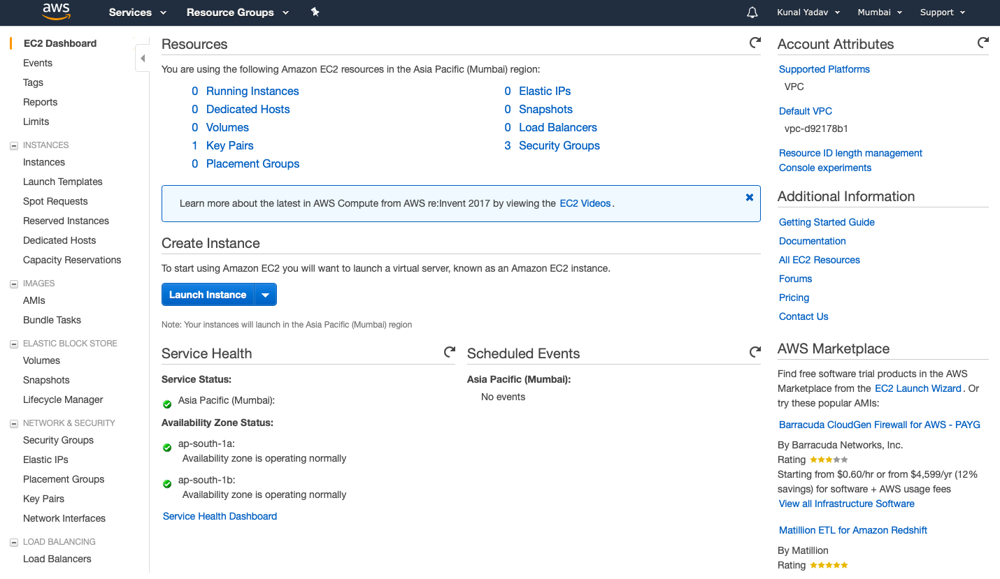

Now click on **Launch Instance**button.

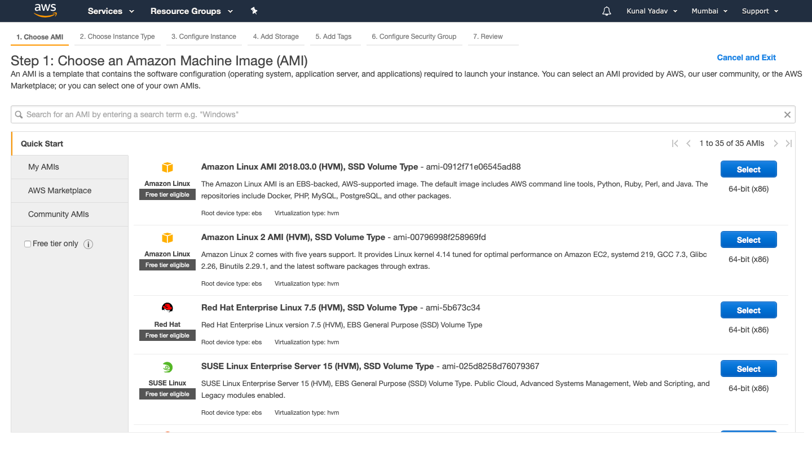

**A**. The first step is to choose the Amazon Machine Image (AMI) that
will be used to launch our instance. It is like a configurable ISO file
of your Operating System.

You have the option of selecting AMIs provided by AWS, AWS community
AMIs, AWS marketplace or your own AMIs.

Here I am going to select the first one i.e. Amazon Linux AMI.

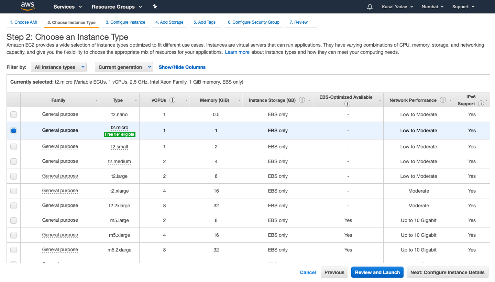

**B**. The second step is to choose an Instance Type. AWS provides a
large number of instances to choose from depending on your use case. You
can scroll down and see instances optimized for compute, graphics,
memory and storage.

Each instance has a fixed number of virtual CPUs and RAM. The larger the
size, more is the computing power and memory size.

I am going to select the **t2.micro** here since its available in the
free tier.

**Note** -If you select any instance other than t2.micro you will
charged.

After selecting the instance of your choice click on the **Next:
Configure Instance Details** button.

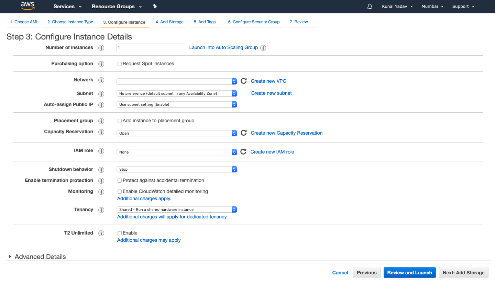

**C**. Now it’s time to configure our instance details. You can hover
over the info button after each option to learn more about that option.

1.  **Number of Instances** — The total number of instances you want to
    launch.
2.  **Purchasing Option **— You can check this checkbox to launch spot
    instances.
3.  **Network** — You can select the VPC in which to launch this
    instance.
4.  **Subnet** — You can specify the preferred subnet (availability
    zone) in which to launch this instance.
5.  **Auto-assign Public IP** — When this option is enabled your EC2
    instance gets a public IP. You can then host a website on this
    server and access it via instance’s public IP.
6.  **Placement Group — **You can add this instance to a placement group
    by selecting this option.
7.  **Capacity Reservation — **Using this option you can reserve
    capacity of your instance in an availability zone. Leave this option
    as default.
8.  **IAM role** — You can assign an IAM role to this instance to allow
    it to access other AWS services without storing access keys on the
    instance.
9.  **Shutdown behavior** — You can stop or terminate an instance when
    an OS-level shutdown is performed.
10. **Enable Termination Protection** — Selecting this option will
    prevent you from accidentally terminating your instances. You will
    have to disable this option to terminate an instance.
11. **Monitoring** — Checking this option will enable Cloudwatch
    detailed monitoring. Detailed monitoring logs your instance’s
    performance metrics every 1 minute as opposed to 5 minutes for basic
    monitoring. Additional charges will be applied if you select this
    option.
12. **Tenancy** — By default your instances are hosted on a shared host.
    You can select dedicated instance or dedicated host to comply with
    your license but you will have to pay additional charges. Leave this
    option as shared.
13. **T2 Unlimited** — Allows your instance to burst CPU utilization in
    case of high traffic. Additional charges may apply when you select
    this option.

Under the Advanced Details section at the bottom of the page you have a
**User data** text field. You can use it to run configuration scripts or
commands to configure your instance.

These scripts or commands will run as soon as your instance starts the
first time.

Now click **Next: Add Storage** button.

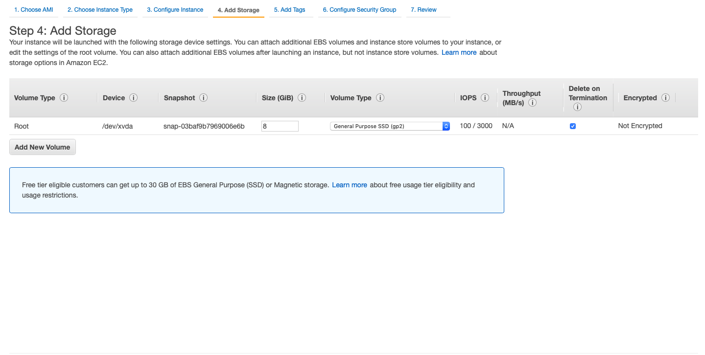

**D**. It’s time to add some storage to our instance. The first volume
that will be attached to your instance will be a **Root volume.**You can
set its size (default is 8 GB) and it’s volume type.

You can select whether to delete this volume when an instance is
terminated. By default root volumes are deleted on termination and
cannot be encrypted.

You can add additional volumes using the **Add New Volume** button.
Additional volumes can be encrypted and are not deleted on termination
by default.

For the root volume you have three options for Volume type -

1.  General Purpose SSD (gp2)
2.  Provisioned IOPS SSD (io1)
3.  Magnetic (standard)

For other volumes you have two additional options along with the above
three-

1.  Throughput Optimized HDD (st1)
2.  Cold HDD (sc1)

Usually SSD type volumes are faster and expensive than HDD type volumes.

I am not going to make any changes here so click **Next: Add
Tags**button.

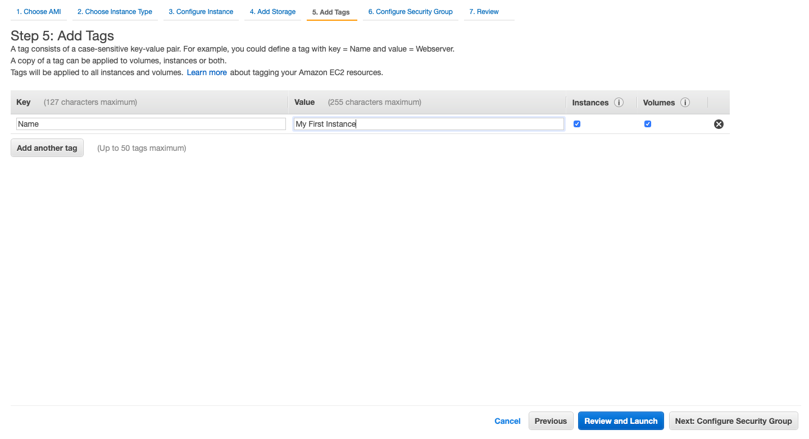

**E**. Here we can add tags to our instance. A tag are just key-value
pair.

Tags can be used to group instances by departments and teams. They can
be used to search for resources across an AWS account.

They can also help in managing costs of resources.

Here I am adding a single tag with Key of "Name" and Value as "My First
Instance".

Now click on **Next: Configure Security Group.**

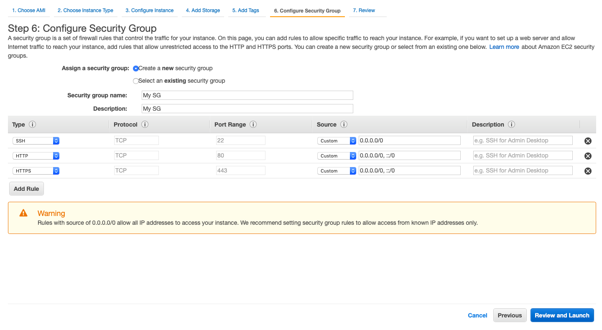

**F**. Now we are going to configure our security group. A security
group acts as a firewall for our instances. We can use it to open
different ports for different applications.

Here I am opening the SSH port since we will be logging in to our
instance once it is running.

HTTP and HTTPS ports are opened since we are going to install an apache
server on our instance once it’s running.

In the source tab you can see that we have entered **0.0.0.0/0** to allow
our instance to accept traffic from anywhere on the internet. This is
the reason why we are seeing the warning on the screen.

For our personal case this won’t be an issue but for a company you will
want the source for SSH to be your company’s static IPs.

Now click on **Review and Launch.**

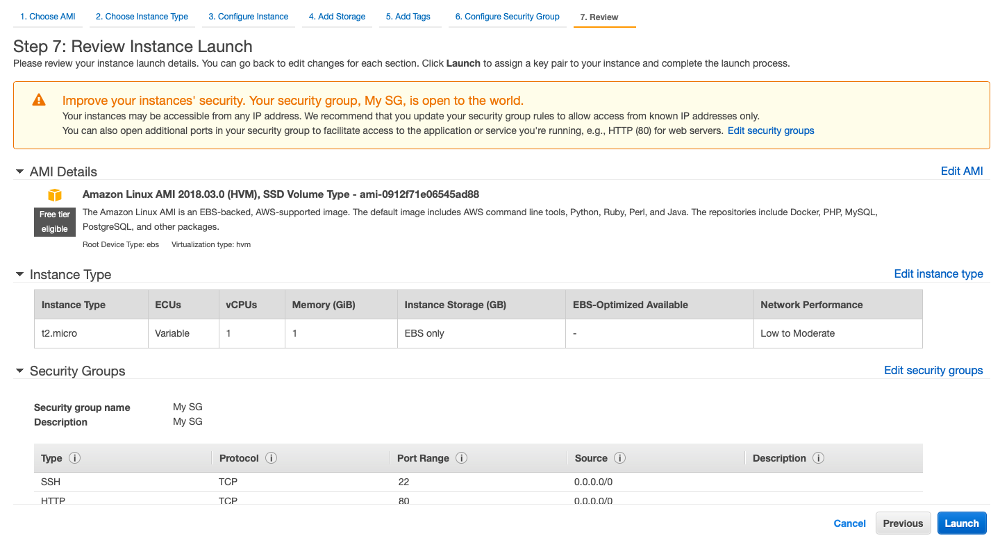

**G**. You can review the instance details now. Next click on
**Launch**button.

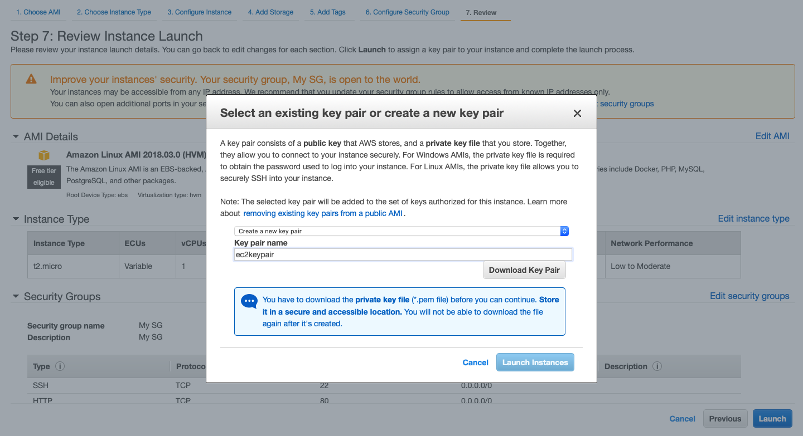

**H**. Now you will see a pop up for selecting a key pair.

Select **Create a new key pair** option and enter a key pair name and
click on **Download Key Pair.**

After downloading the key pair file click on **Launch Instances**
button.

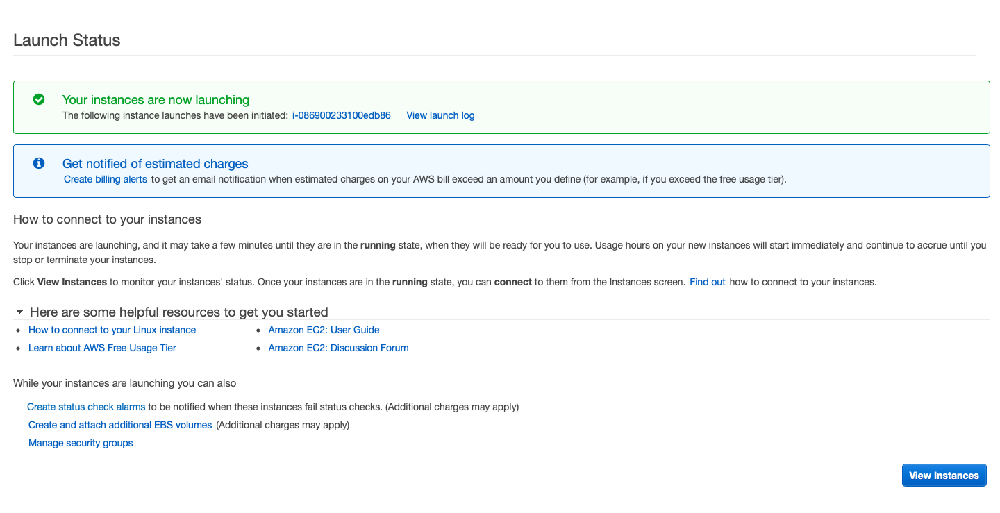

We can see that our instance is now launching, click on **View Instances** and wait a few minutes until the instance is running.

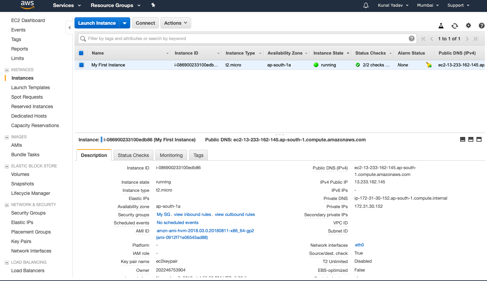

Congratulations, You have just launched your first EC2 instance!

You can now see that our instance has a public DNS and a Public IP
address. We will use this IP address to SSH into our instance.

### SSH into EC2 instance

If you are using Linux or MacOS open your **terminal**, if you are using
Windows, download [**git bash**](https://git-scm.com/downloads)****to
continue.

​1. In terminal or git bash, navigate to the folder where you have saved
the key pair file and type the following command to change the file
permissions.

For Linux and Mac users — `sudo chmod 600 ec2keypair.pem` 

For Windows users — `chmod 600 ec2keypair.pem`

In place of ec2keypair.pem enter the name of your key pair file.

​2. Now, to log in to your ec2 instance type the following command.

`ssh ec2-user@public-ip-address -i ec2keypair.pem`

If you are prompted to type yes or no, type yes.

The above commands looks like the following on my terminal.

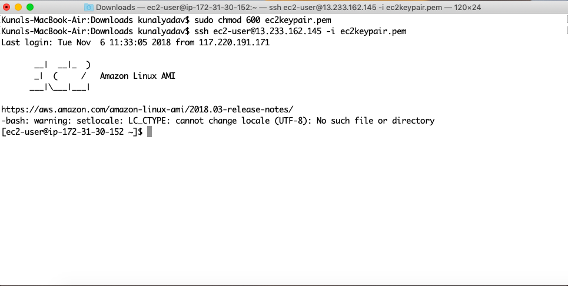

Now type the following commands in the terminal to start an apache server.

```
sudo yum update -y
sudo yum install -y httpd
sudo service httpd start
sudo chkconfig httpd on
```

Once the following commands are completed. Enter your IP in a web
browser and press enter.

You will see a page similar to this.

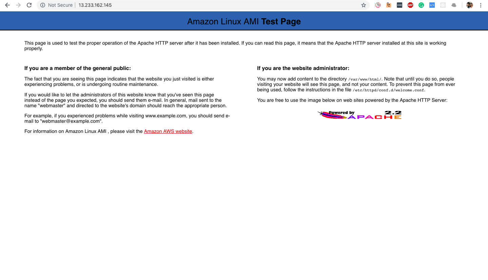

Congratulations, you have just installed an apache server on your EC2
instance.

Now you can terminate the instance from the EC2 dashboard using the
Actions tab in the navigation.
