# What is Amazon Elastic Load Balancer (ELB)
Amazon ELB allows you to make your applications highly available by
using health checks and distributing traffic across a number of
instances.

Consider that you have a WordPress blog which is running on a single
t2-micro EC2 instance.

Now you publish an article, it goes viral and your site gets hundreds of
thousands of requests. Since you are using a single t2-micro, your
website will probably crash.

So, what can you do to avoid this?

You may decide to launch a larger instance like an m5-large in place of
t2-micro. This is called vertical scaling when you replace an instance
with a more powerful instance.

But vertical scaling isn’t always economical.

Another approach can be to use a bunch of smaller instances like
t2-micros and distribute the website traffic between them. And Elastic
Load Balancer allows you to do just that.

It distributes incoming application or network traffic across multiple
targets, such as Amazon EC2 instances, containers, and IP addresses, in
multiple Availability Zones.

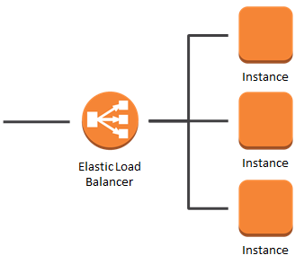

Credits — aws.amazon.com

It uses health checks to detect which instances are healthy and directs
traffic only across those instances.

### Types of Elastic Load Balancers

There are three types of load balancers available. You can use the one
that best fits your use case.

#### 1. Classic Load Balancer (CLB)

This is the previous generation load balancer that was used for
EC2-classic instances.

It operates on both the request level and the connection level. But it
doesn’t support features like host-based routing or path-based routing.

Once configured, it distributes the load across all the registered
instances regardless of what is present on the servers.

Hence, it can only be used to distribute traffic to a single URL.

#### 2. Application Load Balancer (ALB)

This load balancer is specially designed for web applications with HTTP
and HTTPS traffic.

There is a networking model called the OSI Model (Open Systems
Interconnection) that is used to explain how computer networks work.
This model has 7 layers and the top layer is the Application Layer.

This load balancer works at this Application Layer, hence the name.

It also provides advanced routing features such as host-based and
path-based routing and also works with containers and microservices.

**Host-based Routing**

Suppose you have two websites **medium.com** and **admin.medium.com**.
Each website is hosted on two EC2 instances for high availability and
you want to distribute the incoming web traffic between them.

If you were using the CLB you would have to create two load balancers,
one for each website.

But you can do the same thing using a single ALB!

Hence you will be saving money as you will only be paying for a single
ALB instead of two CLBs.

**Path-based Routing**

Suppose the website of your company is **payzello.com** and the
company’s blog is hosted on **payzello.com/blog**. The operations team
has decided to host the main website and the blog on different
instances.

Using ALB you can route traffic based on the path of the requested URL.
So again a single ALB is enough to handle this for you.

#### 3. Network Load Balancer (NLB)

This load balancer operates at the Network layer of the OSI model, hence
the name.

Suppose your company’s website is running on four m4-xlarge instances
and you are using an ALB to distribute the traffic among them.

Now your company launched a new product today which got viral and your
website starts to get millions of requests per second.

In this case, the ALB may not be able to handle the sudden spike in
traffic.

This is where the NLB really shines. It has the capability to handle a
sudden spike in traffic since it works at the connection level.

It also provides support for static IPs.

I hope by this time you have got a rough idea about load balancers. Now,
enough talking, let’s go practical.

### Creating an Application Load Balancer

We will handle a case of path-based routing. We will be handling two
paths here, "/" and "/blog".

We will launch two instances, one for handling each path. Let’s get
started!

#### 1. Launch two EC2 instances

To learn how to launch an EC2 instance, you can read my article on
[Launching an Amazon EC2
instance](https://hackernoon.com/launching-an-ec2-instance-fbfd50894aac).

When launching, give a Name tag to your instances.

For the first instance, give a tag with **Name** as key and **Main** as
the value. For the second instance, give a tag with **Name**as key and
**Blog**as the value. This will help us in distinguishing between them.

After launching the two instances, your dashboard should look like this.

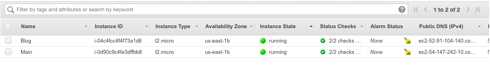

2. **Install Apache server on instances**

Now SSH into the first instance (with name Main) and run the following
commands to install and start the apache server.

```
sudo yum update -y
sudo yum install -y httpd
sudo service httpd start
sudo chkconfig httpd on
cd /var/www/html
sudo su
echo "This is the Main Website" > index.html
```

Now paste the IP address of the instance in the browser and hit Enter.

You should see something as shown in the picture below.

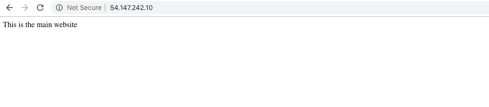

Now SSH into the second instance (with name Blog) and run the same
commands except the last command. Instead, run the following command.

`echo "This is the Blog Website" > blog`

Paste the IP address of this instance with **/blog** as the suffix in
the browser and hit Enter. You should see something like below.


#### **3. Create Target Groups**

A target group allows you to tell the load balancer which protocol and
port will receive the traffic on the registered instances.

​1. In the left navigation bar, scroll down and click on **Target Groups.**

Now click on **Create target group** at the top.

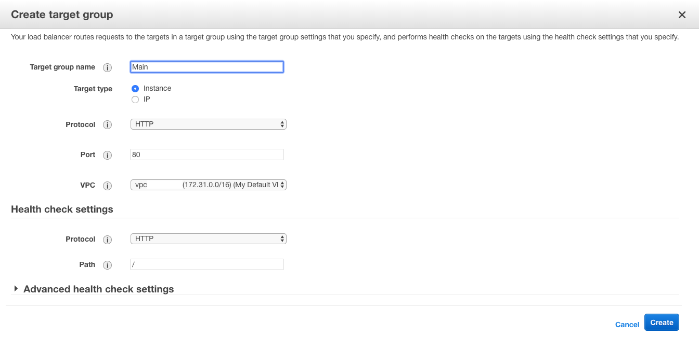

​2. Give your target group a name **Main** and click **Create**button.

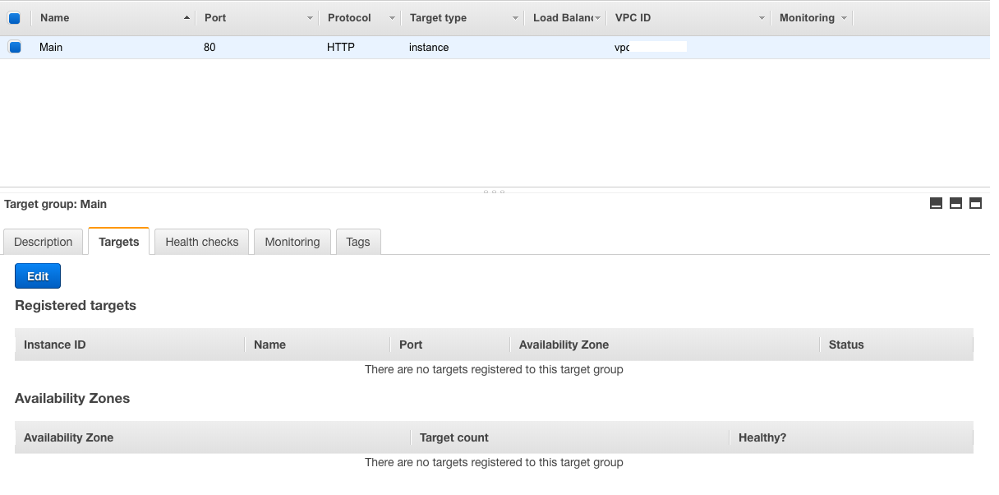

​3. Now, navigate to the **Targets** tab at the bottom, click on
**Edit,**select the Main instance, click **Add to registered**and
click**Save.**

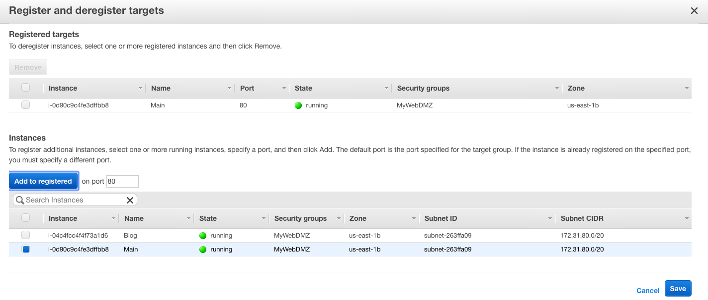

Create another target group with the name Blog and add the Blog instance
to it as we did above.

#### 4. Creating and configuring the Application Load Balancer

Now, in the left navigation scroll down and click on **Load
Balancers.**Click on the **Create Load Balancer** button at the top.

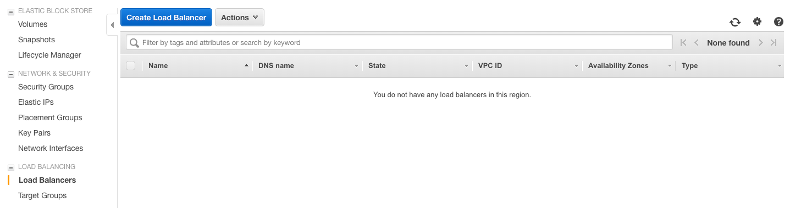

​1. Choose the Application Load Balancer.


​2. Give a name to your load balancer and select at least two
availability zones for high availability and click on the **Next:
Configure Security Settings**button.

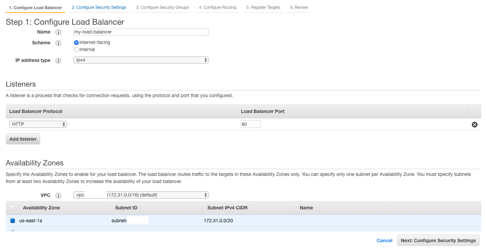

​3. You may see a warning message but that is because we are only
listening for HTTP traffic which is fine for our case, so click on the
**Next: Configure Security Groups** button again.

​4. Here select the existing group option and select the same security
group that you assigned to the instances you launched. Once done click
on **Next: Configure Routing** button.

​5. In Target groups, select the existing target group. In the name
select **Main** and click **Next.**

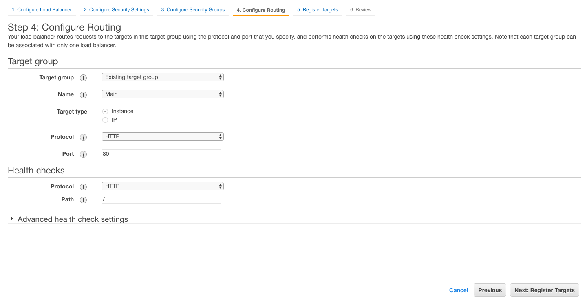

​6. Click Next again, review and click **Create.**

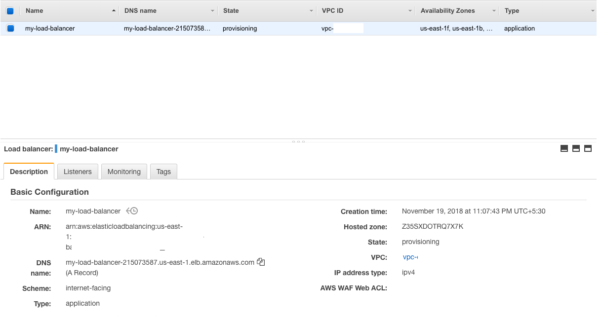

Congratulations, you have just created an Application Load Balancer!

But we still have to configure our Blog instance so let’s continue. Take
a note of the **DNS name** of the Load balancer here. We will need it at
the end.

​7. Select the **Listeners** tab and Click on **View/edit rules**.

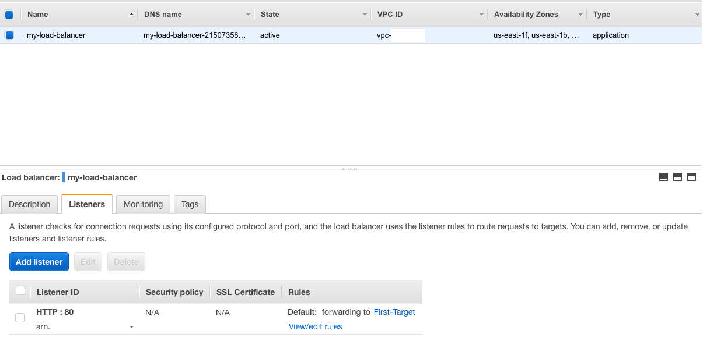

​8. Click the + sign at the top to add a rule. In Add Condition select
"**Path is**" and type **/blog**.

​9. Then in Add Action select **Forward to** and select **Blog**and then
click**Save.**

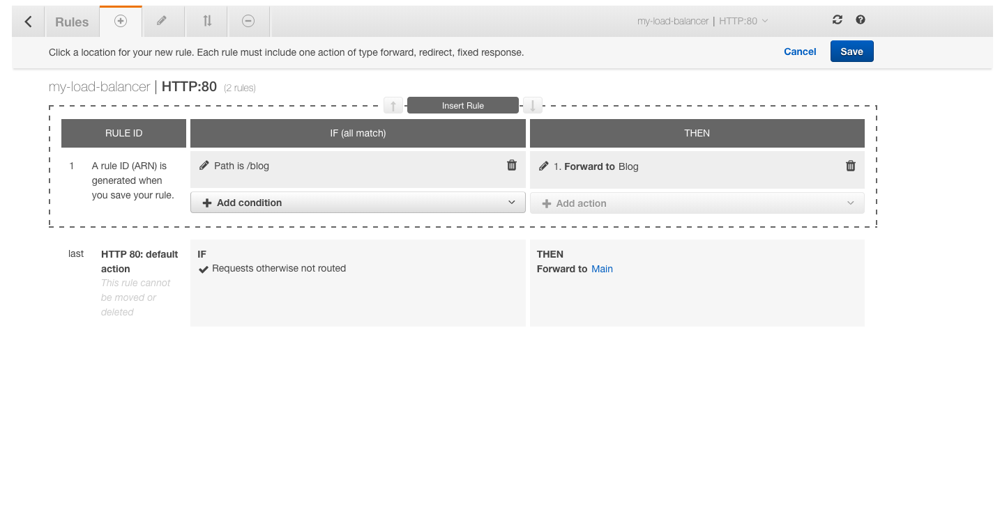

Now, we can use the **DNS name**of our load balancer to visit the two
different paths and see the results.

For /


For /blog


