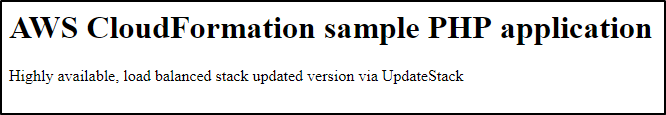

Launching and Managing a Web Application with AWS CloudFormation
================================================================

- Overview
- Task 1: Create an Amazon S3 bucket using AWS CloudFormation
- Task 2: Delete the Stack
- Task 3: Change The Retention Policy
- Task 4: Provision a Web 
- Task 5: Change Resources Properties
- Task 6: Add Resources Properties
- Task 7: Create an Auto-Scaled Application

Overview
--------

In this lab you will learn how to use **AWS CloudFormation** to provision and update a web application with a number of supporting AWS products and services, including Auto Scaling groups, Amazon Elastic Cloud Compute (EC2) instances, and Elastic Load Balancing.

In the first part you will create a simple resource, an **Amazon S3 bucket**, with AWS CloudFormation and you will look at different retention policies applied when you delete an AWS CloudFormation stack or during a rollback.

In the second part, you will provision a simple PHP web application using an Amazon Linux instance. You will then see how to re-apply an AWS CloudFormation template to the existing application to change some resource attributes such as an Amazon EC2 instance type. Finally, you will add a **load balancer** and an **Auto Scaling group** based on an Auto Scaling configuration.

### Topics covered

By the end of this lab, you will be able to:

-   Create an Amazon Simple Storage Service (S3) bucket using AWS CloudFormation
-   Provision a simple PHP web application using an Amazon Linux AMI
-   Apply an AWS CloudFormation template to an existing application
-   Modify an existing application using AWS CloudFormation
-   Add IAM roles and Elastic Load Balancing to the application using AWS CloudFormation

### Technical knowledge prerequisites

To successfully complete this lab, you should be comfortable editing scripts in a text editor.

**Other AWS Services**

Other AWS Services than the ones needed for this lab are disabled by IAM policy during your access time in this lab. In addition, the capabilities of the services used in this lab are limited to what’s required by the lab and in some cases are even further limited as an intentional aspect of the lab design. Expect errors when accessing other services or performing actions beyond those provided in this lab guide.

**AWS CloudFormation** gives developers and systems administrators an easy way to create and manage a collection of related AWS resources, provisioning and updating them in an orderly and predictable fashion.

You can use AWS CloudFormation sample templates or create your own templates to describe the AWS resources, and any associated dependencies or runtime parameters, required to run your application. You don’t need to figure out the order for provisioning AWS services or the subtleties of making those dependencies work. AWS CloudFormation takes care of this for you. After the AWS resources are deployed, you can modify and update them in a controlled and predictable way, in effect **applying version control to your AWS infrastructure the same way you do with your software**.

You can deploy and update a template and its associated collection of resources (called a stack) by using the AWS Management Console, AWS Command Line Interface, or APIs. AWS CloudFormation is available at no additional charge, and you pay only for the AWS resources needed to run your applications.

**An AWS CloudFormation template** is a declaration of the AWS resources that make up a **stack**. The template is stored as a text file in either JavaScript Object Notation (JSON) or YAML format. Because they are just text files, you can create and edit them in any text editor and manage them in your source control system with the rest of your source code.

In the template, you use a JSON structure that AWS CloudFormation can interpret to declare the AWS resources you want to create and configure. In the JSON format, an object is declared as a name-value pair or a pairing of a name with a set of child objects enclosed within braces. Multiple sibling objects are separated by commas. An AWS CloudFormation template begins with an open brace and ends with a close brace. Within those braces, you can declare six top-level JSON objects: AWSTemplateFormatVersion, Description, Parameters, Mappings, Resources, and Outputs.

The only required top-level object is the **Resources** object, which must declare at least one resource. This lab will start with the most basic template containing only a Resources object, which contains a single resource declaration.

Definitions of each of these objects can be found in the online [Template Anatomy](http://docs.aws.amazon.com/AWSCloudFormation/latest/UserGuide/concept-template.html#concept-template-description) documentation.

Start Lab
---------

-   Open https://808477742599.signin.aws.amazon.com/console
-   Enter login credentials

Task 1: Create an Amazon S3 bucket using AWS CloudFormation
-----------------------------------------------------------

You will start with a very simple AWS CloudFormation template to create a single Amazon S3 bucket with public read rights.

**Amazon S3** provides a simple web services interface that can be used to store and retrieve any amount of data, at any time, from anywhere on the web. It gives any developer access to the same highly scalable, reliable, secure, fast, inexpensive infrastructure that Amazon uses to run its own global network of websites. The service aims to maximize benefits of scale and to pass those benefits on to developers.

Examine this CloudFormation template:

```
AWSTemplateFormatVersion: 2010-09-09
Description: Basic S3 Bucket CloudFormation template
Resources:
  S3BucketForWebsiteContent:
    Type: AWS::S3::Bucket
    Properties:
      AccessControl: PublicRead
Outputs:
  BucketName:
    Value: !Ref S3BucketForWebsiteContent
    Description: Name of the newly created Amazon S3 Distribution
```

The **Resources** object contains a list of resource objects.

A resource declaration contains the resource's attributes, which are themselves declared as child objects. A resource must have a *Type* attribute, which defines the kind of AWS resource you want to create. The *Type* attribute has a special format:

```
AWS::ProductIdentifier::ResourceType
```

For example, the resource type for an Amazon S3 bucket is:

Now take a look at a very basic template. The following template declares a single resource of type with the name *S3BucketForWebsiteContent*.

```
Resources:
  S3BucketForWebsiteContent:
    Type: AWS::S3::Bucket
```

The syntactic elements are quoted strings. If you use this template to create a stack, AWS CloudFormation will create an Amazon S3 bucket. Creating a bucket is simple, because AWS CloudFormation can create a bucket with default settings. For other resources, such as a CloudFront distribution, Auto Scaling group, or Amazon EC2 instance, AWS CloudFormation requires more information. Resource declarations use a *Properties* attribute to specify the information used to create a resource.

Depending on the resource type, some properties are required, such as the ImageId property for an AWS::EC2::Instance resource, and others are optional. Some properties have default values, such as the AccessControl property of the AWS::S3::Bucket resource, so specifying a value for those properties is optional. Other properties are not required but may add functionality that you want, such as the WebsiteConfiguration property of the AWS::S3::Bucket resource. Specifying a value for such properties is entirely optional and based on your needs. In the example above, because the AWS::S3::Bucket resource has only optional properties and you didn't need any of the optional features, you could accept the defaults and omit the Properties attribute.

**Resource properties and using resources together**

Usually, a property for a resource is simply a string value. For example, the following template specifies a canned ACL (PublicRead) for the AccessControl property of the bucket:

```
Resources:
  S3BucketForWebsiteContent:
    Type: AWS::S3::Bucket
    Properties:
      AccessControl: PublicRead
```

**Optional outputs**

In the Outputs section, you can optionally define custom values that are returned in response to the cfn-describe-stacks command. These output values can include information based on literals, resources, parameters, pseudo parameters, and intrinsic functions.

```
Outputs:
  BucketName:
    Value: !Ref S3BucketForWebsiteContent
    Description: Name of the newly created Amazon S3 Distribution
```

At the top of the template, AWSTemplateFormatVersion is simply the version of the template format; if you don't specify it, AWS CloudFormation will use the latest version. The Description is any valid JSON string, and this description appears in the Specify Parameters page of the Create Stack wizard.

```
AWSTemplateFormatVersion: 2010-09-09
Description: Basic S3 Bucket CloudFormation template
```

### Create an AWS CloudFormation Stack

You will now use AWS CloudFormation to create a stack of AWS resources.

1.  Download this template to your computer: [lab1.yaml](https://s3-us-west-2.amazonaws.com/us-west-2-aws-training/awsu-spl/spl-10/3.6.11.prod/scripts/lab1.yaml) template.

The template contains:

```
AWSTemplateFormatVersion: 2010-09-09
Description: Basic S3 Bucket CloudFormation template
Resources:
  S3BucketForWebsiteContent:
    Type: AWS::S3::Bucket
    Properties:
      AccessControl: PublicRead
Outputs:
  BucketName:
    Value: !Ref S3BucketForWebsiteContent
    Description: Name of the newly created Amazon S3 Distribution
```

1.  In the **AWS Management Console**, on the Services menu, click **CloudFormation**.

2.  If you see this message, click Try it out now and provide us feedback:


A stack already appears in the list. This was created for you when the lab was started. You will be creating an additional stack.

1.  Click Create stack then configure:

-   Click ** Upload a template file
-   Click Choose file
-   Browse to and select the *lab1.yaml* template you downloaded.
-   Click Next

1.  On the **Create stack** page, configure:

-   **Stack name:**
-   Click Next

The **Configure stack options** page allows you to specify Tags, Permissions and Advanced Options.

1.  Scroll to the bottom of the screen, then click Next

You will use the default values.

1.  On the **Review** page:

-   Review the configuration
-   Click Create stack

The new stack status will be *CREATE\_IN\_PROGRESS* until the Amazon S3 bucket creation is complete.

1.  Click the **refresh** button every 30 seconds until you see the stack status change to *CREATE\_COMPLETE*.

2.  Click the **Outputs** tab in the lower part of the screen to see the name of the new bucket.

You can now view the bucket in the S3 Management Console.

### View The S3 Bucket

1.  On the Services menu, click **S3**.

You will now see your newly created bucket, starting with . Notice also that AWS CloudFormation automatically created another bucket named *cf-template-xxx* where it stores the templates you upload.

Task 2: Delete the Stack
------------------------

You will now delete the stack you created and see how all resources created by this stack are deleted.

### Delete the Stack

1.  On the Services menu, click **CloudFormation**.

2.  Select **Lab-1**.

3.  Click Delete.

4.  Click Delete stack

The stack status should now be *DELETE\_IN\_PROGRESS* for a few minutes. The list will be updated, and you will see that the stack is gone.

1.  Wait for the status the stack to disappear from the list (refresh ** as necessary).

### Verify That The S3 Bucket Has Been Deleted

1.  On the Services menu, click **S3**.

The *Lab-1* bucket has been deleted.

Task 3: Change The Retention Policy
-----------------------------------

A common use-case is to store application assets in Amazon S3. They can be results of heavy data processing, files uploaded by users, or any other valuable data. Automatically deleting an Amazon S3 bucket when deleting an AWS CloudFormation stack is usually an unwanted behavior. You will see now how to configure the AWS CloudFormation template and specify that it should not delete some of the resources when deleting the stack.

### Download and View the Template

1.  Download the [lab2.yaml](https://s3-us-west-2.amazonaws.com/us-west-2-aws-training/awsu-spl/spl-10/3.6.11.prod/scripts/lab2.yaml) template and examine it.

The template file should now look like this:

```
AWSTemplateFormatVersion: 2010-09-09
Description: Basic S3 Bucket CloudFormation template
Resources:
  S3BucketForWebsiteContent:
    Type: AWS::S3::Bucket
    DeletionPolicy: Retain
    Properties:
      AccessControl: PublicRead
Outputs:
  BucketName:
    Value: !Ref S3BucketForWebsiteContent
    Description: Name of the newly created Amazon S3 Distribution
```

This line indicates that the resource should not be deleted once created, either in case of user-initiated stack deletion or in case of rollback:

```
    DeletionPolicy: Retain
```

### Create a New Stack Using The Template

You will now create a new stack from the modified template, then delete it and verify that the newly created Amazon S3 bucket is still available.

1.  On the Services menu, click **CloudFormation**.

2.  Click Create stack then configure:

-   Click ** Upload a template file
-   Click Choose file
-   Browse to and select the *lab2.yaml* template you downloaded.
-   Click Next

1.  On the **Create stack** page, configure:

-   **Stack name:**
-   Click Next

1.  On the **Configure stack options** page, scroll to the bottom of the screen, then click Next

2.  On the **Review** page:

-   Review the configuration
-   At the bottom of the page, click Create stack

The new stack status will be *CREATE\_IN\_PROGRESS* until the Amazon S3 bucket creation is complete.

1.  Click the **refresh** button every 30 seconds until you see the stack status change to *CREATE\_COMPLETE*.

2.  Click the **Outputs** tab.

3.  Verify the new bucket is listed.

The bucket value will start with *lab-2*.

### Verify The Bucket Has Been Created

1.  On the Services menu, click **S3**.

2.  Verify that the new *lab-2* bucket was created.

### Delete The Stack

1.  On the Services menu, click **CloudFormation**.

2.  Select **Lab-2**.

3.  Click Delete

4.  Click Delete stack

5.  Wait for the stack deletion to be completed.

### Check to See if the S3 Bucket Exists

1.  On the Services menu, click **S3**.

2.  Verify that the Amazon S3 bucket has **not** been deleted.

In this first part of the lab you learned the basics of AWS CloudFormation, the structure of the JSON file template, and simple resources creation. You have learned about DeletionPolicy and how resources are deleted.

In the next part you will review more advanced features of AWS CloudFormation: using cfn-init, receiving inputs, using mappings and updating stacks.

Task 4: Provision a Web Application
-----------------------------------

This section walks through a simple progression of updates of a running stack. It shows how the use of templates makes it possible to use a version control system for the configuration of your AWS infrastructure, just as you use version control for the software you are running. You will walk through the following steps:

-   **Create the initial stack:** Create a stack using a base Amazon Linux AMI, installing the Apache Web Server and a simple PHP application using the AWS CloudFormation helper scripts.
-   **Update the application:** Update one of the files in the application and deploy the software using AWS CloudFormation.
-   **Update the instance type:** Change the instance type of the underlying Amazon EC2 instance.
-   **Update IAM role:** Change the role assigned to the instance to another role providing additional permissions.
-   **Change the stack's resources:** Add and remove resources from the stack, converting it to an auto-scaled, load-balanced application by updating the template.

The steps in this lab are based on a Walkthrough in the AWS CloudFormation documentation: [Updating a Stack](http://docs.amazonwebservices.com/AWSCloudFormation/latest/UserGuide/updating.stacks.walkthrough.html).

**A Simple Application**

You will begin by creating a stack that you can use throughout the rest of this section. The lab has provided a simple template that launches a single instance PHP web application hosted on the Apache Web Server and running on an Amazon Linux AMI.

The Apache Web Server, PHP, and the simple PHP application are all installed by the AWS CloudFormation helper scripts that are installed by default on the Amazon Linux AMI. The following template snippet shows the metadata that describes the packages and files to install, in this case the Apache Web Server and the PHP infrastructure from the Yum repository for the Amazon Linux AMI. The snippet also shows the Services section, which ensures that the Apache Web Server is running. In the Properties section of the Amazon EC2 instance definition, the UserData property contains the CloudInit script that calls cfn-init to install the packages and files.

1.  Download and examine the [lab3.yaml](https://s3-us-west-2.amazonaws.com/us-west-2-aws-training/awsu-spl/spl-10/3.6.11.prod/scripts/lab3.yaml) template.

The application itself is a very simple two-line "Hello, World" example that is entirely defined within the template. For a real-world application, the files may be stored on Amazon S3, GitHub, or another repository, and referenced from the template. AWS CloudFormation can download packages (such as RPMs or RubyGems), as well as reference individual files and expand .zip and .tar files to create the application artefacts on the Amazon EC2 instance.

The template enables and configures the cfn-hup daemon to listen for changes to the configuration defined in the metadata for the Amazon EC2 instance. By using the cfn-hup daemon, you can update application software, such as the version of Apache or PHP, or you can update the PHP application file itself from AWS CloudFormation.

The following snippet from the same Amazon EC2 resource in the template shows the pieces necessary to configure cfn-hup to call cfn-init to update the software if any changes to the metadata are detected:

```
WebServerHost:
    CreationPolicy:
      ResourceSignal:
        Timeout: PT5M
    Type: AWS::EC2::Instance
    Metadata:
      Comment: Install a simple PHP application
      AWS::CloudFormation::Init:
        config:
        ...

        files:
        ...

            /etc/cfn/hooks.d/cfn-auto-reloader.conf:
              content: !Sub |
                [cfn-auto-reloader-hook]
                triggers=post.update
                path=Resources.WebServerHost.Metadata.AWS::CloudFormation::Init
                action=/opt/aws/bin/cfn-init -s ${AWS::StackName} -r WebServerHost --region ${AWS::Region}
                runas=root
              mode: 000644
              owner: apache
              group: apache

            /etc/cfn/cfn-hup.conf:
              content: !Sub |
                [main]
                stack=${AWS::StackId}
                region=${AWS::Region}
                interval=1
              mode: 000400
              owner: root
              group: root

        services:
          sysvinit:
            httpd:
              enabled: true
              ensureRunning: true
            cfn-hup:
              enabled: true
              ensureRunning: true
              files:
                - /etc/cfn/cfn-hup.conf
                - /etc/cfn/hooks.d/cfn-auto-reloader.conf

        Properties:
        ...
        UserData:
        ...
```

To complete the stack, the template creates an Amazon EC2 security group and an elastic IP so that you have a consistent IP address to reference the application.

This example uses a single Amazon EC2 instance and Elastic IP address, but you can use the same mechanisms on more complex solutions that make use of Elastic Load Balancing and Auto Scaling groups to manage a collection of application servers. There are, however, some special considerations for Auto Scaling groups.

### Create The Initial Stack

1.  On the Services menu, click **CloudFormation**.

2.  Click Create stack then configure:

-   Click ** Upload a template file
-   Click Choose file
-   Browse to and select the *lab3.yaml* template you downloaded.
-   Click Next

1.  On the **Create stack** page, configure:

-   **Stack name:**
-   **ENV:** *dev*
-   **VPCId:** Copy the value to the left of these instructions
-   **VPCPublicSubnetId:** Copy the value to the left of these instructions.
-   Click Next

1.  On the **Configure stack options** page, scroll to the bottom of the screen, then click Next

2.  On the **Review** page:

-   Review the configuration
-   Select the **I acknowledge that ...**
-   Click Create stack

1.  Click the **refresh** button every 30 seconds to see the updated events till the status of your stack displays *CREATE\_COMPLETE*.

The stack takes about five minutes to create. While you are waiting, examine the Events and Resources tabs that show the stack creation progress.

1.  Click the **Outputs** tab.

The **Outputs** tab will display the URL of your website.

1.  Copy and paste the **WebsiteURL** into a new browser tab.

2.  Press **Enter** to navigate to the website.

You should see a simple page with the following message:


Task 5: Change Resources Properties
-----------------------------------

With AWS CloudFormation, you can change the properties of an existing resource in the stack. The following sections describe various updates that solve specific problems; however, any property of any resource that supports updating in the stack can be modified as necessary.

The stack you have built uses a t2.micro Amazon EC2 instance. Pretend that your newly created website is getting more traffic than what a t2.micro instance can handle and you want to move to an t2.small Amazon EC2 instance type to handle the traffic.

Within the mappings section of the template, you can see that there is a mapping for the EC2 instance type. If you choose the *prod* environment, a t2.small instance will be provisioned for you and if you choose the *dev* environment, a t2.micro instance will be provisioned for you.

```
Mappings:
  EC2TypeConfig:
    prod:
      InstanceType: t2.small
    dev:
      InstanceType: t2.micro
```

It will be easy to change your instance type because *ENV* was an input parameter to your template. Therefore, you do not need to modify your template; you can simply change the value of the parameter in the Stack Update wizard, on the **Specify Parameters** page.

```
  ENV:
    Type: String
    Default: dev
    AllowedValues:
      - dev
      - prod
```

1.  In the **CloudFormation Management Console**, select **Lab-3**.

2.  Click Update, then configure:

-   Select **Use current template**
-   Click Next

1.  On the **Specify stack details** page, configure:

-   **ENV** *prod*
-   Click Next

1.  On the **Configure stack options** page, scroll to the bottom of the screen, then click Next

2.  On the **Review** page:

-   Review the configuration
-   View the list of the changes that will be deployed
-   Select the **I acknowledge that...**.
-   Click Update stack

The instance type of an Amazon EC2 instance can be changed by starting and stopping the instance. AWS CloudFormation tries to optimize the change by updating the instance type and restarting the instance, so the Instance ID does not change. When the instance is restarted, however, the public IP address of the instance does change. To ensure that the Elastic IP address is bound correctly after the change, AWS CloudFormation will also update the Elastic IP address. You can see the changes in the AWS CloudFormation console on the Events tab. Here you have changed more than just the Instance Type, hence the first instance is terminated and a new one is launched.

1.  Click the **refresh** button every 30 seconds to see the updated events till the status of your stack displays *Update\_COMPLETE*.

2.  On the Services menu, click **EC2**.

3.  In the left navigation pane, click **Instances**.

4.  Confirm that the instance type has changed by going to the EC2 management console and viewing the Instance Type. It should be *t2.small*.

Task 6: Add Resources Properties
--------------------------------

So far, you've looked at changing existing properties of a resource in a template. You can also add properties that were not originally specified in the template. To illustrate this, you will update your EC2 instance so that it is tagged with a name and you will also open port 22.

1.  Download and examine the [lab4.yaml](https://s3-us-west-2.amazonaws.com/us-west-2-aws-training/awsu-spl/spl-10/3.6.11.prod/scripts/lab4.yaml) template.

This code adds a name tag to your EC2 instance

```
    Properties:
      Tags:
        - Key: Name
          Value: Web server - port 80 and 22
```

This code adds port **22** to the ingress rules for the Amazon EC2 security group:

```
  WebServerSecurityGroup:
    Type: AWS::EC2::SecurityGroup
    Properties:
      GroupDescription: Enable HTTP
      VpcId: !Ref VPCId
      SecurityGroupIngress:
        - IpProtocol: tcp
          FromPort: 80
          ToPort: 80
          CidrIp: 0.0.0.0/0
        - IpProtocol: tcp
          FromPort: 22
          ToPort: 22
          CidrIp: 0.0.0.0/0
```

1.  On the Services menu, click **CloudFormation**.

2.  Select **Lab-3**.

3.  Click Update, then configure:

-   Click ** Replace current template
-   Click ** Upload a template file
-   Click Choose file
-   Browse to and select the *lab4.yaml* template you downloaded
-   Click Next

1.  On the **Specify stack details** page, click Next

2.  On the **Configure stack options** page, scroll to the bottom of the screen, then click Next

3.  On the **Review** page, review the parameters.

The **Preview your changes** section will show how resources will be updated.

1.  Select **I acknowledge that...**.

2.  Click Update stack

3.  Click the **refresh** button every 30 seconds to see the updated events till the status of your stack displays *UPDATE\_COMPLETE*.

4.  Click the **Outputs** tab.

The **Outputs** tab will display the URL of your website.

1.  Copy and paste the **WebsiteURL** into a new browser tab.

2.  Press **Enter** to navigate to the website.

You should see the following message showing that the stack has been successfully updated:


Task 7: Create an Auto-Scaled Application
-----------------------------------------

Next, you will change the IAM role that is assigned to the Amazon EC2 instance and which eventually helps the code running on it to make AWS API calls. Suppose that a new version of the application requires access to the Amazon EC2 read-only APIs from the instance.

1.  Download and examine the updated template: [lab5.yaml](https://s3-us-west-2.amazonaws.com/us-west-2-aws-training/awsu-spl/spl-10/3.6.11.prod/scripts/lab5.yaml) template.

This code is providing the name of another role that was created as part of the lab setup. The role **ec2-role-2** was created as part of the lab setup and provides permissions to call EC2 read-only APIs.

```
  WebServerInstanceProfile:
    Type: AWS::IAM::InstanceProfile
    Properties:
      Path: /
      Roles:
        - ec2-role-2
```

This change will update the role assigned to the instance; it does not require other changes in the stack. When the stack is updated, the Amazon EC2 instance will have access to the Amazon EC2 read-only APIs.

Since application needs can change over time, AWS CloudFormation allows you to change the set of resources that make up the stack. To demonstrate, you’ll take the single instance application from the previous section and convert it to an auto-scaled, load-balanced application by updating the stack.

The template will remove the Elastic IP address resource from the template:

```
  Endpoint:
    Type: AWS::EC2::EIP
    Properties:
      InstanceId: !Ref WebServerHost
```

The template will add an Elastic Load Balancer resource:

```
  ElasticLoadBalancer:
    Type: AWS::ElasticLoadBalancing::LoadBalancer
    Properties:
      Subnets:
        - !Ref VPCPublicSubnetId
      SecurityGroups:
        - !Ref WebServerSecurityGroup
      Listeners:
        - LoadBalancerPort: 80
          InstancePort: 80
          Protocol: HTTP
      HealthCheck:
        Target: HTTP:80/
        HealthyThreshold: 3
        UnhealthyThreshold: 5
        Interval: 30
        Timeout: 5
```

The template will also convert the Amazon EC2 instance in the template into an Auto Scaling Launch Configuration. The properties are identical, it only needs to change the type name from:

```
  WebServerHost:
    Type: AWS::EC2::Instance
```

to

```
  WebServerConfig:
    Type: AWS::AutoScaling::LaunchConfiguration
```

For clarity in the template, the name of the resource has also been changed from **WebServerHost** to **WebServerConfig**.

The template includes an Auto Scaling group resource:

```
WebServerGroup:
    Type: AWS::AutoScaling::AutoScalingGroup
    Properties:
      AvailabilityZones:
        - !Ref VPCPublicSubnetAZ
      LaunchConfigurationName: !Ref WebServerConfig
      MinSize: 2
      MaxSize: 3
      LoadBalancerNames:
        - !Ref ElasticLoadBalancer
      VPCZoneIdentifier:
        - !Ref VPCPublicSubnetId
```

The security group definition allows traffic to all IPs. However, in a production environment, we recommend that you restrict the traffic to the ELB security group.

```
  WebServerSecurityGroup:
    Type: AWS::EC2::SecurityGroup
    Properties:
      GroupDescription: Enable HTTP
      VpcId: !Ref VPCId
      SecurityGroupIngress:
        - IpProtocol: tcp
          FromPort: 80
          ToPort: 80
          CidrIp: 0.0.0.0/0
```

Finally, the Output section will now return the DNS Name of the load balancer as the location of the application:

```
Outputs:
  WebsiteURL:
    Value: !Sub 'http://${ElasticLoadBalancer.DNSName}'
    Description: Application URL
```

If you use this template to update the stack, you will convert your simple, single-instance application into a highly available, multi-AZ, auto-scaled and load balanced application. Only the resources that need to be updated will be altered, so if there were any data stores for this application, the data would have remained intact. Now, you can use AWS CloudFormation to grow or enhance your stacks as your requirements change.

1.  Select **Lab-3**.

2.  Click Update, then configure:

-   Click ** Replace current template
-   Click ** Upload a template
-   Click Choose file
-   Browse to and select the *lab5.yaml* template you downloaded
-   Click Next

1.  On the **Specify stack details** page, configure:

-   **VPCPublicSubnetAZ:** Copy and paste the value to the left of these instructions
-   Click Next

1.  On the **Configure stack options** page, scroll to the bottom of the screen, then click Next

2.  On the **Review** page, review the parameters.

3.  Select **I acknowledge that...**

4.  Scroll to the bottom of the screen, then click Update stack

5.  Click the **refresh** button every 30 seconds to see the updated events till the status of your stack displays *UPDATE\_COMPLETE*.

6.  Wait three minutes after the AWS CloudFormation update is finished.

This gives time for Auto Scaling/Elastic Load Balancing to launch and configure all resources.

1.  Click the **Outputs** tab.

2.  Copy the new **WebSiteURL** into a new browser tab.

This is not an IP address anymore, but instead is the DNS name of the load balancer of your newly high-availability application.

1.  Press **Enter** to navigate to the website.



1.  Click the **Resources** tab of the AWS CloudFormation stack.

You should see the following list of resources types that were created:

-   IAM Instance Profile
-   EC2 SecurityGroup
-   ELB LoadBalancer
-   AutoScaling Group + AutoScaling Launch Configuration
-   CloudFormation WaitCondition (you can place a wait condition in a template to make AWS CloudFormation pause the creation of the stack and wait for a signal before it continues to create the stack.) \_\_\_ \#\# Availability and impact considerations

Different properties have different impacts on the resources in the stack. You can use AWS CloudFormation to update any property; however, before you make any changes, you should consider these questions:

-   **How does the update affect the resource itself?** For example, updating an alarm threshold will render the alarm inactive during the update. As you have seen, changing the instance type requires that the instance be stopped and restarted. AWS CloudFormation uses the Update or Modify actions for the underlying resources to make changes to resources. To understand the impact of updates, you should check the documentation for the specific resources.

-   **Is the change mutable or immutable?** Some changes to resource properties, such as changing the AMI on an Amazon EC2 instance, are not supported by the underlying services. In the case of mutable changes, AWS CloudFormation will use the Update or Modify type APIs for the underlying resources. For immutable property changes, AWS CloudFormation will create new resources with the updated properties and then link them to the stack before deleting the old resources. Although AWS CloudFormation tries to reduce the downtime of the stack resources, replacing a resource is a multistep process, and it will take time. During stack reconfiguration, your application will not be fully operational. For example, it may not be able to serve requests or access a database.

End Lab
-------

Follow these steps to close the console, end your lab, and evaluate the experience.

1.  Return to the AWS Management Console.

2.  On the navigation bar, click **awsstudent@\<AccountNumber\>**, and then click **Sign Out**.

Conclusion
----------

Congratulations! You now have successfully learned how to:

-   Create an Amazon Simple Storage Service (S3) bucket using AWS CloudFormation
-   Provision a simple PHP web application using an Amazon Linux AMI
-   Apply an AWS CloudFormation template to an existing application
-   Modify an existing application using AWS CloudFormation
-   Add IAM roles and Elastic Load Balancing to the application using AWS CloudFormation

The template used throughout this section is a "Hello, World" PHP application. The template library also has an Amazon ElastiCache sample template that shows how to integrate a PHP application with ElastiCache using cfn- hup and cfn-init to respond to changes in the Amazon ElastiCache Cache Cluster configuration, all of which can be performed by Update Stack.


