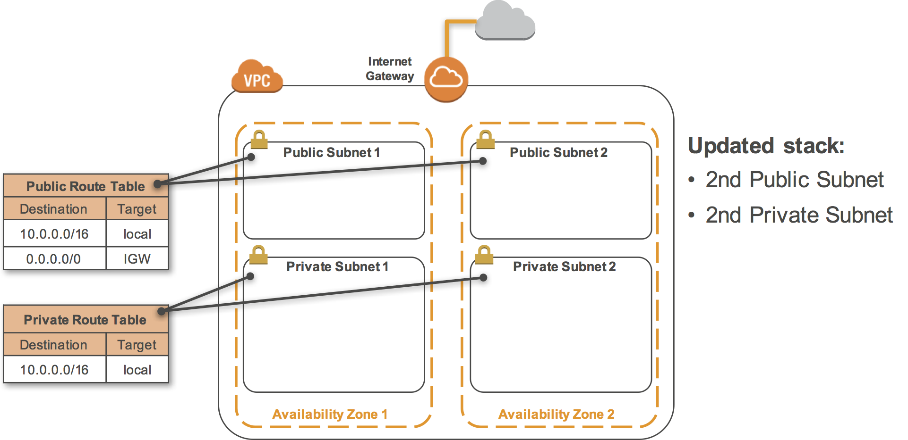

Creating an Amazon Virtual Private Cloud (VPC) with AWS CloudFormation
======================================================================

- Overview
- Introducing the Technologies
- Task 1: Deploy a Stack using AWS CloudFormation
- Task 2: Examine the VPC
- Task 3: Updating a Stack
- Task 4: Viewing a Stack in CloudFormation Designer
- Task 5: Delete the Stack
- Conclusion

Overview 
--------

This lab shows how to create an Amazon Virtual Private Cloud (VPC) using AWS CloudFormation.

Using AWS CloudFormation is an excellent way to deploy VPCs in a reliable, repeatable manner because the template used by CloudFormation acts as documentation to show exactly what is being deployed.

You will walkthrough sections of an AWS CloudFormation template and examine the resources that are deployed. You will also learn how to perform updates through CloudFormation.

### Topics covered

In this lab you will:

-   Deploy an AWS CloudFormation template that creates an Amazon VPC
-   Examine the components of the template
-   Update a CloudFormation stack
-   Examine a template with the AWS CloudFormation Designer
-   Delete a CloudFormation stack

### Technical knowledge prerequisites

To successfully complete this lab, you should be familiar with Amazon Virtual Private Cloud (VPC) concepts.

Introducing the Technologies 
----------------------------

### AWS CloudFormation

**AWS CloudFormation** gives developers and systems administrators an easy way to create and manage a collection of related AWS resources, provisioning and updating them in an orderly and predictable fashion.

You can use AWS CloudFormation’s sample templates or create your own **templates** to describe the AWS resources, and any associated dependencies or runtime parameters, required to run your application. You don’t need to figure out the order for provisioning AWS services or the subtleties of making those dependencies work. CloudFormation takes care of this for you. After the AWS resources are deployed, you can modify and update them in a controlled and predictable way, in effect applying version control to your AWS infrastructure the same way you do with your software.

You can deploy and update a template and its associated collection of resources (called a **stack**) by using the AWS Management Console, AWS Command Line Interface, or APIs. CloudFormation is available at no additional charge, and you pay only for the AWS resources needed to run your applications.

### Amazon Virtual Private Cloud (VPC)

**Amazon Virtual Private Cloud (Amazon VPC)** lets you provision a logically isolated section of the AWS cloud where you can launch resources within a virtual network. You have complete control over your virtual networking environment, including selection of your own IP address range, creation of subnets, and configuration of route tables and network gateways.

You can easily customize the network configuration for your virtual private cloud. For example, you can create a **public-facing subnet** for your web servers that has access to the Internet and place your backend systems such as databases or application servers in a **private-facing subnet** with no Internet access. You can leverage multiple layers of security, including security groups and network access control lists, to help control access to Amazon EC2 instances in each subnet.

Start Lab
---------

-   Open https://808477742599.signin.aws.amazon.com/console
-   Enter login credentials

Task 1: Deploy a Stack using AWS CloudFormation 
-----------------------------------------------

In this task, you will deploy a pre-defined template to build a VPC.

3.  Right-click this link and download the CloudFormation template to your computer: [vpc-1.yaml](https://s3-us-west-2.amazonaws.com/us-west-2-aws-training/awsu-spl/spl-15/scripts/vpc-1.yaml)

You will examine the contents of the template in the next task.

4.  In the **AWS Management Console**, on the Services menu, click **CloudFormation**.

5.  If you see this message, click Try it out now and provide us feedback:


6.  Click Create stack then configure:

-   Click `Upload a template file`
-   Click Choose file
-   Browse to and select the *vpc-1.yaml* file you downloaded.
-   Click Next

7.  On the **Create stack** page, configure:

-   **Stack name:**
-   Click Next

The **Options** page allows you to specify Tags, Permissions and Advanced Options.

8.  On the **Configure stack options** page, scroll to the bottom of the screen, then click Next

You will use the default values.

9.  On the **Review** page:

-   Review the configuration
-   Click Create stack

The stack status will be *CREATE\_IN\_PROGRESS* until the resources have been created.

While you are waiting, look in the **Events** tab to view the work being performed by CloudFormation.

If you do not see the **Events** tab, it is because your web browser window is too narrow. Either make the window wider until the tabs appear, or click the pull-down arrow in the **Overview** tab.

10. Click the **Stack info** tab.

11. Wait until the status changes to ***CREATE\_COMPLETE***. Click the Refresh icon every 30 seconds to update the status.

When the stack status is ***CREATE\_COMPLETE***, it means that the resources have been created.

12. Click the **Resources** tab.

A list of resources is displayed. These resources will be explained in the next task. You may need to refresh the screen to see the resources.

Task 2: Examine the VPC 
-----------------------

In this task, you will examine the VPC resources that were created together with the code from the CloudFormation template that created the resources.

Here are the resources that have been created by CloudFormation:


-   An Amazon VPC
-   An Internet Gateway
-   Two Subnets
-   Two Route Tables

These resources all reside within one **Availability Zone**. An Availability Zone is an isolated location within a Region, and consists of one or more data centers.

13. On the Services menu, click **VPC**.

14. In **Filter by VPC** in the top-left corner, select **Lab VPC**.

This configures the VPC console to only display resources that belong to the VPC created by CloudFormation.

15. In the left navigation pane, click **Your VPCs**.

16. Select **Lab VPC**.

A VPC is an isolated section of the AWS Cloud that allows resources to communicate with each other and, selectively, with the Internet. When deploying resources such as Amazon EC2 instances, you must select the VPC in which the instance will be launched.

The **Summary** tab displays the **IPv4 CIDR**, which is a range of IP addresses assigned to the VPC. This VPC has a CIDR of *10.0.0.0/16*, which means it contains all IP addresses that start with .

Here is the code from the CloudFormation template that created this VPC:

```
AWSTemplateFormatVersion: 2010-09-09
Description: Deploy a VPC

Resources:
  VPC:
    Type: AWS::EC2::VPC
    Properties:
      CidrBlock: 10.0.0.0/16
      EnableDnsHostnames: true
      Tags:
      - Key: Name
        Value: Lab VPC
```

This code is in YAML format. AWS CloudFormation can also accept code in JSON format. If you are more familiar with JSON, you can download the [JSON version of this template](https://s3-us-west-2.amazonaws.com/us-west-2-aws-training/awsu-spl/spl-15/scripts/vpc-1.json).

The **Type** parameter in the above code declares the type of resources being created by CloudFormation. The **Properties** section then specifies more information about the resource to create. In this case, it defines:

-   **CidrBlock:** The IP address range associated with the VPC.
-   **EnableDnsHostnames:** Configures the VPC to associate DNS names with Amazon EC2 instances.
-   **Tags:** Adds a friendly name to the resource.

Each type of resource has a different set of properties that can be used.

17. In the left navigation pane, click **Internet Gateways**.

An **Internet gateway** is a horizontally scaled, redundant, and highly available VPC component that allows communication between instances in your VPC and the Internet. It therefore imposes no availability risks or bandwidth constraints on your network traffic.

An Internet gateway serves two purposes: to provide a target in your VPC route tables for Internet-routable traffic, and to perform network address translation (NAT) for instances that have been assigned public IPv4 addresses.

Here is the code from the CloudFormation template that created this Internet Gateway:

```
  InternetGateway:
    Type: AWS::EC2::InternetGateway
    Properties:
      Tags:
      - Key: Name
        Value: Lab Internet Gateway
```

In the management console, the Internet Gateway is showing that it is *attached* to the VPC. This was done with this code in the CloudFormation template:

```
  AttachGateway:
    Type: AWS::EC2::VPCGatewayAttachment
    Properties:
      VpcId: !Ref VPC
      InternetGatewayId: !Ref InternetGateway
```

A VPC Gateway Attachment creates a relationship between a VPC and a gateway, such as this Internet Gateway.

Notice that the template refers to other elements in the template with the *!Ref* keyword, followed by the name of the other resource. This makes it easy to build resources that link to each other simply by referencing their name.

18. In the left navigation pane, click **Subnets**.

Two subnets will appear:

-   **Public Subnet 1** is connected to the Internet via the Internet Gateway and can be used by resources that need to be publicly accessible.
-   **Private Subnet 1** is *not* connected to the Internet. Any resources in this subnet cannot be reached from the Internet, thereby providing additional security around these resources.

Here is the code from the CloudFormation template that created the subnets:

```
  PublicSubnet1:
    Type: AWS::EC2::Subnet
    Properties:
      VpcId: !Ref VPC
      CidrBlock: 10.0.0.0/24
      AvailabilityZone: !Select
        - '0'
        - !GetAZs ''
      Tags:
        - Key: Name
          Value: Public Subnet 1

  PrivateSubnet1:
    Type: AWS::EC2::Subnet
    Properties:
      VpcId: !Ref VPC
      CidrBlock: 10.0.1.0/24
      AvailabilityZone: !Select
        - '0'
        - !GetAZs ''
      Tags:
        - Key: Name
          Value: Private Subnet 1
```

The properties are:

-   **VpcId** refers to the VPC that contains the subnet.
-   **CidrBlock** is the range of IP address assigned to the subnet.
-   **AvailabilityZone** defines which physical location within the Region should contain the subnet.

Note that the Availability Zone is using a function called **!Select** and a function called **!GetAZs**. The code is retrieving a list of Availability Zones within the region and is referencing the first element from the list. In this manner, the template can be used in any region because it retrieves the list of Availability Zones at runtime rather than having the Availability Zones hard-coded in the template.

19. In the left navigation pane, click **Route Tables**.

20. Select the **Public Route Table**.

21. Click the **Routes** tab in the lower half of the window.

Route Tables are used to direct (or *route*) traffic in and out of subnets. The configuration for this route table is:

-   For traffic within the VPC (10.0.0.0/16), route the traffic locally.
-   For traffic going to the Internet (0.0.0.0/0), route the traffic to the Internet Gateway (indicated by *igw-*).

Here is the code from the CloudFormation template that created the Public Route Table:

```
  PublicRouteTable:
    Type: AWS::EC2::RouteTable
    Properties:
      VpcId: !Ref VPC
      Tags:
        - Key: Name
          Value: Public Route Table
```

There is also similar code for the Private Route Table.

Here is the code that defined the route to the Internet within the Public Route Table:

```
  PublicRoute:
    Type: AWS::EC2::Route
    Properties:
      RouteTableId: !Ref PublicRouteTable
      DestinationCidrBlock: 0.0.0.0/0
      GatewayId: !Ref InternetGateway
```

The configuration for the route is:

-   **RouteTableId** indicates the Route Table that owns the route.
-   **DestinationCidrBlock** defines the IP address range for this routing rule (where 0.0.0.0/0 refers to traffic bound for the Internet).
-   **GatewayId** defines where to route the traffic, which in this case is the Internet Gateway that was defined earlier in the template.

This Route is only configured for the Public Route Table, which is what makes it *public*.

22. Click the **Subnet Associations** tab.

The console shows that the Public Route Table is *associated* with **Public Subnet 1**. A Route Table can be associated with multiple subnets, with each association requiring an explicit linkage.

Here is the code that defined this linkage:

```
  PublicSubnetRouteTableAssociation1:
    Type: AWS::EC2::SubnetRouteTableAssociation
    Properties:
      SubnetId: !Ref PublicSubnet1
      RouteTableId: !Ref PublicRouteTable
```

It declares that **Public Subnet 1** is associated with the **Public Route Table**.

In additional to creating resources, CloudFormation can provide information about the resources that have been created.

23. On the Services menu, click **CloudFormation**.

24. Select the **Lab** stack.

25. Click the **Outputs** tab.

The CloudFormation template has been configured to return information about the resources it created:

-   **VPC** is the ID of the VPC that was created.
-   **AZ1** shows the Availability Zone in which the Subnets were created.

Here is the code that configured the Outputs:

```
Outputs:
  VPC:
    Description: VPC
    Value: !Ref VPC

  AZ1:
    Description: Availability Zone 1
    Value: !GetAtt
      - PublicSubnet1
      - AvailabilityZone
```

The VPC output is simply a reference to the VPC, which results in the VPC ID being displayed.

The AZ1 output uses the **!GetAtt** function to retrieve an *attribute* of the resources. In this case, it is retrieving the AvailabilityZone attribute from Public Subnet 1.

Task 3: Updating a Stack 
------------------------

Once a CloudFormation stack has been deployed, it is recommended that any changes to the resources should be made through CloudFormation rather than by directly modifying the resources.

In this task, you will update the stack with a new CloudFormation template that defines the following resources:



Additional public and private subnets have been added in another Availability Zone. This is best practice to ensure that your resources can run in multiple data centers (Availability Zones) to ensure *High Availability* in case of system failures.

26. Right-click this link to download an updated CloudFormation template to your computer: [vpc-2.yaml](https://s3-us-west-2.amazonaws.com/us-west-2-aws-training/awsu-spl/spl-15/scripts/vpc-2.yaml)

(A [JSON version of this template](https://s3-us-west-2.amazonaws.com/us-west-2-aws-training/awsu-spl/spl-15/scripts/vpc-2.json) is also available.)

27. Click Update, then configure:

-   Select `Replace current template`
-   Click `Upload a template file`
-   Click `Choose file`
-   Select the **vpc-2.yaml** template you just downloaded.

28. Click Next

29. Click Next

You will accept the default Options.

30. Scroll to the bottom of the screen, then click Next

Examine the **Change set preview** section at the bottom of the page. It is displaying what will happen when the stack is updated:

It indicates that two new Subnets will be created. In addition, two *Route Table Associations* will be added, to associate these Subnets with their appropriate Route Tables.

31. Scroll to the bottom of the screen, then click Update stack

Examine the **Events** tab while the stack is updating.

32. Click the **Stack info** tab.

Click the Refresh occasionally until the status is ***UPDATE\_COMPLETE***.

33. Click the **Outputs** tab.

An additional Availability Zone is displayed, with a different value to the original Availability Zone.

34. On the Services menu, click **VPC**.

35. In **Filter by VPC** in the top-left corner, select **Lab VPC**.

36. In the left navigation pane, click **Subnets**.

Four subnets are now displayed. Click each of them and examine their settings in the **Route Table** tab.

The VPC has now been updated to support Highly Available applications.

Task 4: Viewing a Stack in CloudFormation Designer 
--------------------------------------------------

In this task, you will view the template using the AWS CloudFormation Designer.

** AWS CloudFormation Designer (Designer) is a graphic tool for creating, viewing, and modifying AWS CloudFormation templates. With Designer, you can diagram your template resources using a drag-and-drop interface, and then edit their details using the integrated JSON and YAML editor. Whether you are a new or an experienced AWS CloudFormation user, AWS CloudFormation Designer can help you quickly see the interrelationship between a template's resources and easily modify templates.

37. On the Services menu, click **CloudFormation**.

38. Select the **Lab** stack.

39. Click the **Template** tab.

40. Click View in Designer

The top portion of the window provides a graphical overview of the VPC that is defined by the template.

41. Use the Zoom controls to examine the diagram. You can move the diagram by dragging the image.

42. At the bottom of the page, click the **Components** tab.

43. Click on some elements in the diagram.

The lower portion of the window displays the code within the template that defines the resource.

Arrows show the relationship between resources, such as Route Tables that are associated with Subnets.

44. For **Choose template language**, click **JSON**.

The Designer can also convert code between JSON and YAML formats.

Task 5: Delete the Stack 
------------------------

In this task, you will delete the stack, which will automatically delete the VPC and its components.

45. At the top-left of the screen, click the **Close** link.

This will exit the Designer. If prompted, click **Leave** to exit.

46. Select the **Lab** stack.

47. Click Delete, then click Delete stack

48. Click the **Events** tab to view details of the deletion.

Click Refresh until the stack is deleted.

When the stack has been deleted, it will disappear from the list.

Your VPC has also been deleted.

49. On the Services menu, click **VPC**.

50. In the left navigation pane, click **Your VPCs**.

The **Lab VPC** is no longer listed. In addition, the associated Internet Gateway, Subnets and Route Tables have been deleted.

Conclusion
----------

Congratulations! You now have successfully learned how to:

-   Deploy an AWS CloudFormation template that creates an Amazon VPC
-   Examine the components of the template
-   Update a CloudFormation stack
-   Examine a template with the AWS CloudFormation Designer
-   Delete a CloudFormation stack

End Lab 
-------

Follow these steps to close the console, end your lab, and evaluate the experience.

51. Return to the AWS Management Console.

52. On the navigation bar, click **\<yourusername\>@\<AccountNumber\>**, and then click **Sign Out**.
