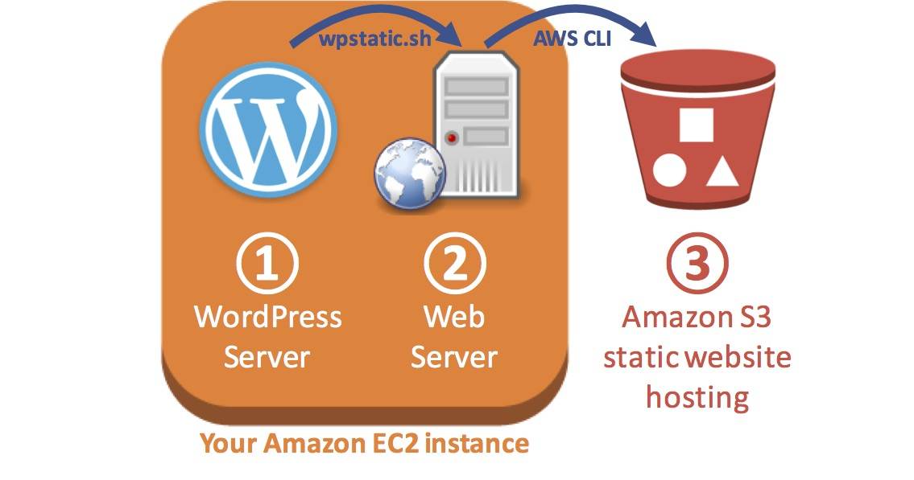

Hosting WordPress Using Amazon S3
=================================

- Overview
- Start Lab
- Task 1: Configure WordPress on Amazon EC2
- Task 2: Create an Amazon S3 static website
- Task 3: Log in to your Amazon EC2 instance
- Task 4: Generate a static version of WordPress
- Task 5: Uploading static WordPress pages to Amazon S3
- Task 6: Using scripts to upload changes to Amazon S3
- Conclusion

Overview
--------

This lab demonstrates how to use Amazon S3 for static website hosting.
In this lab, you convert a WordPress website into a static website
hosted on Amazon S3. The same concepts for enabling static website
hosting in Amazon S3 covered in this lab can be used for hosting any
static website, not just WordPress.

With a static website, individual webpages include static content. They
might also contain client-side scripts. By contrast, a dynamic website
relies on server-side processing, including server-side scripts such as
PHP, JSP, or ASP.NET. Amazon S3 does not support server-side scripting.

WordPress by its nature is a dynamic website. In order to host a dynamic
website, some form of a web server is required, such as an instance
running on Amazon EC2 to host the web server application and database.
This requires you to maintain not only the web application, but also the
host operating system where it is running. You may also need to scale
your application as the load increases, requiring more resources and
adding to your maintenance and costs. An alternative to this is to
convert your WordPress site to a static website. This has the advantage
of dramatically reducing the hosting cost for a website while supporting
a large-scale user base.



### Topics covered

This lab will cover:

-   Configuring WordPress on Amazon EC2.
-   Exporting WordPress to static files.
-   Copying static files to an Amazon S3 static website.
-   Creating a script to send your Wordpress changes to Amazon S3.

### Technical knowledge prerequisites

In order to successfully complete this exercise, you should be familiar
with basic website concepts.

Start Lab
---------

-   Open https://808477742599.signin.aws.amazon.com/console
-   Enter login credentials

Task 1: Configure WordPress on Amazon EC2
-----------------------------------------

An Amazon EC2 instance containing WordPress has been automatically
provisioned as part of this lab.

In this task, you will configure and start using WordPress.

** WordPress is an open-source content management system that can be
used to host web pages, blog posts and even shopping websites. It is
highly extensible via a plugin and templating system. WordPress runs
more than 60 million websites on the Internet.

3.  On the left of the page you are currently reading, copy the
    **WordPressURL**.

This URL is a link to your WordPress website.

4.  Paste the URL into a new web browser tab and press Enter.

The WordPress configuration page displays.

5.  Configure the following values:

-   **Site Title:** Enter any title you wish
-   **Username:** `student`
-   **Password:** `student123`
-   **Confirm Password:** Select Confirm use of weak password
-   **Your Email:** `student@example.com`
-   **Search Engine Visibility:** Do not change

6.  Click **Install WordPress**.

You are presented with a *Success* screen.

7.  Click **Log In** and then log in with these credentials:

-   **Username:** `student`
-   **Password:** `student123`

The WordPress dashboard displays.

You can now create a blog post to add information to your website.

8.  Under **Next Steps**, click **Write your first blog post**.

9.  Enter a **Title** and write some text. Be creative!

10. After you have finished, click **Publish...** at the top-right, and
    then click **Publish** again to save your blog post.

You can now view your website.

11. Click the icon in the top-left of the screen.

Your website is displayed. Scroll down to view your blog post.

Leave this browser tab open. You will use it again later.

Task 2: Create an Amazon S3 static website
------------------------------------------

In this task, you create an Amazon S3 bucket and configure it for static
website hosting. This makes the bucket accessible on the Internet via a
URL.

In a later step, you will use this bucket to host a static (unchanging)
version of your WordPress website.

12. Return to the browser tab containing the AWS Management Console that
    you opened at the start of this lab.

If you cannot find the correct browser tab, click the **Open
Console** button on the left of this page to open a new tab with the AWS
Management Console.

13. In the AWS Management Console, click Services and then click **S3**.

14. Click  `Create bucket` then configure:

-   **Bucket name:** `wordpress-NUMBER`
-   Replace **NUMBER** with a random number
-   Click Create

** If you receive an error stating **The requested bucket name is not
available**, click the first **Edit** link, change the bucket name and
try again until it works.

15. Click the name of the bucket you created. The bucket overview window
    opens.

16. Click the **Permissions** tab. The **Block public access** button is
    highlighted. If it is not, click it.

17. Click Edit at the right of the screen to change the settings.

18. **Deselect** the **Block *all* public access** option, and then
    leave all other options **deselected**.

Notice all of the individual options remain deselected. When
deselecting all public access, you must then select the individual
options that apply to your situation and security objectives. In a
production environment, it is recommended to use the least permissive
settings possible.

19. Click Save

20. A dialogue box opens asking you to confirm your changes. Type `confirm` in the
    field, and then click Confirm

You will now configure the bucket for static website hosting.

21. Click the **Properties** tab at the top of the screen.

22. Click **Static website hosting**.

23. Copy the **Endpoint** to your text editor for later use.

It will look similar to:
*http://wordpress-jb92.s3-website-us-west-2.amazonaws.com*

24. In the **Static website hosting** dialog box:

-   Select **Use this bucket to host a website**
-   **Index document:** `index.html`
-   Click Save

Your Amazon S3 bucket is now ready to receive content from your
Wordpress website.

Task 3: Log in to your Amazon EC2 instance
------------------------------------------

In this task, you log in to your Amazon EC2 instance. The Public IP
address of the instance is displayed to the left of these instructions
as *PublicIP*.

[Mac/Linux users - click here for Login
instructions](https://run.qwiklabs.com/focuses/347?catalog_rank=%7B%22rank%22%3A7%2C%22num_filters%22%3A0%2C%22has_search%22%3Atrue%7D&parent=catalog&search_id=3928994#ssh-mac)

### Windows users: Using SSH to connect

** These instructions are for Windows users only.

If you are using Mac or Linux, [skip to the next
section](https://run.qwiklabs.com/focuses/347?catalog_rank=%7B%22rank%22%3A7%2C%22num_filters%22%3A0%2C%22has_search%22%3Atrue%7D&parent=catalog&search_id=3928994#ssh-MACLinux).

25. To the left of the instructions you are currently reading, click **
    **Download PPK**.

26. Save the file to the directory of your choice.

You will use PuTTY to SSH to Amazon EC2 instances.

If you do not have PuTTY installed on your computer, [download it
here](https://the.earth.li/~sgtatham/putty/latest/w64/putty.exe).

27. Open PuTTY.exe.

28. Configure the PuTTY connection to remain open for a longer period of
    time:

-   Click **Connection**.
-   Set **Seconds between keepalives** to .

29. Configure your PuTTY session:

-   Click **Session**.
-   **Host Name(or IP address):** Copy and paste the **PublicIP** shown
    to the left of these instructions.

If you do not see **PublicIP**, wait a few minutes for it to appear.

-   In the **Connection** list, expand **SSH**.
-   Click **Auth** (don't expand it).
-   Click **Browse**.
-   Browse to and select the PPK file that you downloaded.
-   Click **Open** to select it.
-   Click **Open**.

30. Click **Yes**, to trust the host and connect to it.

31. When prompted **login as**, enter `ec2-user`.

This will connect to your EC2 instance.

32. [Windows Users: Click here to skip ahead to the next
    step.](https://run.qwiklabs.com/focuses/347?catalog_rank=%7B%22rank%22%3A7%2C%22num_filters%22%3A0%2C%22has_search%22%3Atrue%7D&parent=catalog&search_id=3928994#ssh-after)

### Mac and Linux users

These instructions are for Mac/Linux users only.

33. To the left of these instructions, click **Download PEM**.

34. Save the file to the directory of your choice.

35. Copy this command to a text editor:

```
chmod 400 KEYPAIR.pem

ssh -i KEYPAIR.pem ec2-user@IpAddress
```

36. Replace **KEYPAIR.pem** with the path to the PEM file you
    downloaded.

37. Replace **IpAddress** with the values of **PublicIP** shown to the
    left of these instructions.

If you do not see the **PublicIP**, wait a few minutes for it to appear.

38. In a Terminal, cd to the directory that you downloaded the *.PEM*
    file to.

39. Paste the updated command into the Terminal window and run it.

40. Type `yes` when prompted to allow a first connection to this remote SSH
    server.

Because you are using a key pair for authentication, you will not be
prompted for a password.

You are now logged into your **Web Server** instance.

Task 4: Generate a static version of WordPress
----------------------------------------------

In this task, you will use the **wp-static** utility to generate a
static copy of your Wordpress website as HTML pages. These pages will
contain a copy of the entire website and can be used without the
WordPress server.

** For more information about the **wp-static** utility, see the links
at the end of this guide.

41. Copy and paste these commands into your SSH window to configure the
    Apache web server to allow permlinks override:

```
sudo sed -i.bak -e 's/AllowOverride None/AllowOverride All/g' /etc/httpd/conf/httpd.conf;
```

42. Copy and paste this command into your SSH window to restart the
    Apache web server:

```
sudo service httpd restart
```

43. Copy and paste these commands into your SSH window to download the
    *wpstatic* tool and generate a static HTML version of the WordPress
    web site:

```
cd /var/www/html/wordpress;
sudo wget https://us-west-2-aws-training.s3.amazonaws.com/awsu-spl/spl-39/scripts/wpstatic.sh;
sudo /bin/sh wpstatic.sh -a;
```

** Many lines should be displayed in your SSH window. If this did not
happen, you might need to press ENTER to run the last line of the
commands.

44. Copy and paste this command into your SSH window to make the Apache
    webserver user account the owner of the files created by the
    wpstatic.sh script in /var/www/html/wordpress/:

```
sudo chown -R apache:apache /var/www/html/wordpress
```

You now have a static version of your website! It can be viewed in your
web browser.

45. Copy the **StaticURL** address shown to the left of these
    instructions.

46. Paste the URL into a new web browser tab and press Enter.

You will be presented with your WordPress website, but by examining the
page URLs you will notice that it is now being served as static HTML
pages. WordPress is not involved in serving these static pages.

Task 5: Uploading static WordPress pages to Amazon S3
-----------------------------------------------------

In this task, you use the AWS Command Line Interface (AWS CLI) to copy
the static pages to Amazon S3. Your users are then able to access the
website even when the WordPress web server is turned off.

This has several advantages for your users:

-   Amazon S3 is highly scalable and can service more users than a
    single web server.
-   Serving content from Amazon S3 does not require any Amazon EC2
    instances to be running, thereby lowering costs.

47. Copy and paste these commands into your SSH window to retrieve the
    name of AWS region and the name of your Amazon S3 bucket:

```
# Determine Region
AZ=`curl --silent http://169.254.169.254/latest/meta-data/placement/availability-zone/`
REGION=${AZ::-1}

# Retrieve Amazon S3 bucket name starting with wordpress-*
BUCKET=`aws s3api list-buckets --query "Buckets[?starts_with(Name, 'wordpress-')].Name | [0]" --output text`
```

48. Copy and paste this command into your SSH window to copy the static
    files to your Amazon S3 hosted website:

```
aws s3 sync --acl public-read /var/www/html/wordpress/wordpress-static s3://$BUCKET
```

Your website is now available in Amazon S3!

To view your website, retrieve the **Endpoint** that you earlier saved
into a Text Editor. It should look something like:
*http://wordpress-jb92.s3-website-us-west-2.amazonaws.com*

** If you cannot find the endpoint, return to the web browser tab with
the S3 console, click **Static website hosting** and then click the
**Endpoint** that is displayed.

Task 6: Using scripts to upload changes to Amazon S3
----------------------------------------------------

Now that you have created a static version of your website and have
uploaded changes, you may want to simplify this operation in the future.
In this task, you create a script to upload the changes Amazon S3 to
replace running each command manually.

49. Copy and paste these commands into your SSH window to create a new
    shell script that extracts the pages from WordPress and copy them to
    your Amazon S3 bucket:

```
echo "cd /var/www/html/wordpress; sudo rm -rf wordpress-static; sudo /bin/sh wpstatic.sh -a; aws s3 sync --acl public-read --delete /var/www/html/wordpress/wordpress-static s3://$BUCKET" > $HOME/wordpress-to-s3.sh;

chmod 0755 $HOME/wordpress-to-s3.sh;
```

You can now add a new page to WordPress and then execute the script to
confirm that the content is being copied to Amazon S3.

50. Return to your web browser tab that is running WordPress. If you
    cannot find the tab, simply copy the **WordPressURL** shown to the
    left of these instructions and paste it into a new browser tab.

51. Click the **New** link at the top of the page to create a new
    blog post.

52. Enter a title and some text, click **Publish...**, and then click
    **Publish** again.

53. Copy and paste this command into your ssh session to execute the
    script you created previously:

```
/home/ec2-user/wordpress-to-s3.sh
```

54. Return to your browser tab that is connected to your Amazon S3
    bucket and refresh the page. Your new blog post is displayed on the
    page. If it does not appear, wait one minute and refresh the browser
    page.

If you cannot find the tab, retrieve the **Endpoint** that you earlier
saved into a Text Editor. It should look something like:
*http://wordpress-jb92.s3-website-us-west-2.amazonaws.com*

** If you cannot find the Endpoint, return to the web browser tab with
the S3 Management Console, click **Static website hosting** and click
the **Endpoint** that is displayed.

Conclusion [step9]
----------

Congratulations! You have now successfully:

-   Configured WordPress on Amazon EC2.
-   Exported WordPress to static files.
-   Copied static files to an Amazon S3 static website.

Some things to consider
-----------------------

**Turning off the Amazon EC2 instance:** Once your static pages have
been copied to Amazon S3, you could *stop* your Amazon EC2 instance to
save money. Simply *start* it again when you wish to write another blog
post, then turn it off once the updates have been copied to Amazon S3.

**A friendly URL:** The URL to your Amazon S3 hosted website is not easy
to remember. You could create a more friendly custom domain name using
Amazon Route 53.

**Adding dynamic content to pages:** While WordPress is an interactive
application, pages stored in Amazon S3 are static and cannot respond to
user input. If you want dynamic content on pages, consider using
Javascript to add logic within the web browser, or use plugin services
such as Disqus to host content from a different website.

End Lab
-------

Follow these steps to close the console, end your lab, and evaluate the
experience.

55. Return to the AWS Management Console.

56. On the navigation bar, click **\<yourusername\>@\<AccountNumber\>**,
    and then click **Sign Out**.

**Additional resources:**

-   [Run a hosted WordPress website](http://wordpress.com/)
-   [wp-static plugin for
    WordPress](https://wordpress.org/plugins/static-html-output-plugin/)
-   [wp-static script on GitHub](https://github.com/chnm/WP-Static)
