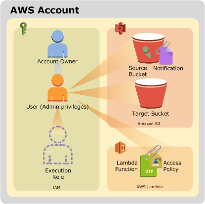

Introduction to AWS Lambda
==========================

- Overview
- Technical Concepts
- Start Lab
- Task 1: Create a Lambda Function
- Task 2: Test the Lambda function
- Conclusion
- End Lab

Overview 
--------

The lab provides a basic explanation of AWS Lambda. It will demonstrate
the steps required to get started to create a Lambda function in an
event-driven environment.

**AWS Lambda** is a compute service that runs your code in response to
events and automatically manages the compute resources for you, making
it easy to build applications that respond quickly to new information.
AWS Lambda starts running your code within milliseconds of an event such
as an image upload, in-app activity, website click, or output from a
connected device. You can also use AWS Lambda to create new back-end
services where compute resources are automatically triggered based on
custom requests.

### Topics covered

By the end of this lab you will be able to:

-   Create an AWS Lambda function
-   Configure an Amazon S3 bucket as a Lambda Event Source
-   Trigger a Lambda function by uploading an object to Amazon S3
-   Monitor AWS Lambda S3 functions through Amazon CloudWatch Log

#### Prerequisites

Familiarity with Amazon S3 would be beneficial.

Start Lab
---------

-   Open https://808477742599.signin.aws.amazon.com/console
-   Enter login credentials

Scenario 
--------

This lab demonstrates AWS Lambda by creating a serverless **image
thumbnail application**.

The following diagram illustrates the application flow:


1 A user uploads an object to the source bucket in **Amazon S3**
(object-created event).

2 Amazon S3 detects the object-created event.

3 Amazon S3 publishes the object-created event to AWS Lambda by invoking
the Lambda function and passing event data as a function parameter.

4 AWS Lambda executes the Lambda function.

5 From the event data it receives, the Lambda function knows the source
bucket name and object key name. The Lambda function reads the object
and creates a thumbnail using graphics libraries, then saves the
thumbnail to the target bucket.

Upon completing this tutorial, you will have the following resources in
your account:



The steps in this lab will show you how to create the Amazon S3 buckets
and the Lambda function. You will then test the service by uploading
images for resizing.

Task 1: Create the Amazon S3 Buckets 
------------------------------------

In this task, you will create two Amazon S3 buckets -- one for input and
one for output.

Amazon S3 buckets require unique names, so you will add a random number
to the bucket name.

3.  In the **AWS Management Console**, on the Services menu, click
    **S3**.

4.  Click ** Create bucket then configure:

-   **Bucket name:**
-   Replace **NUMBER** with a random number
-   Copy the name of your bucket to a text editor
-   Click Create

Every bucket in Amazon S3 requires a unique name such as
*images-34523452345*.

** If you receive an error stating **The requested bucket name is not
available**, then click the first **Edit** link, change the bucket name
and try again until it works.

You will now create another bucket for output.

5.  Click ** Create bucket then configure:

-   **Bucket name:** Paste the name of your *images* bucket
-   At the end of the bucket name, append
-   Click Create

** Do not change the Region.

You should now have buckets named similar to:

-   *images-123*
-   *images-123-resized*

You will now upload a picture for testing purposes.

6.  Right-click this link and download the picture to your computer:
    [HappyFace.jpg](https://s3-us-west-2.amazonaws.com/us-west-2-aws-training/awsu-spl/spl-88/2.3.prod/images/HappyFace.jpg)

7.  Name the file **HappyFace.jpg**.

** Firefox users: Make sure the saved filename is *HappyFace.jpg* (not
*.jpeg)*.

8.  Open the image on your computer.

It is a large picture, with dimensions of 1280 x 853.

9.  In the **S3 Management Console**, click the **images-** bucket. (Not
    the *-resized* bucket)

10. Click ** Upload

11. In the **Upload** window, click Add files

12. Browse to and select the **HappyFace.jpg** picture you downloaded.

13. Click Upload

Later in this lab you will invoke the Lambda function manually by
passing sample event data to the function. The sample data will refer to
this *HappyFace.jpg* image.

Task 2: Create an AWS Lambda Function 
-------------------------------------

In this task, you will create an AWS Lambda function that reads an image
from Amazon S3, resizes the image and then stores the new image in
Amazon S3.

14. On the Services menu, click **Lambda**.

** Do not change the Region. You must use **US West (Oregon)** for this
lab.

15. Click Create a function

**Blueprints** are code templates for writing Lambda functions.
Blueprints are provided for standard Lambda triggers such as creating
Alexa skills and processing Amazon Kinesis Firehose streams. This lab
provides you with a pre-written Lambda function, so you will **Author
from scratch**.

16. In the **Create function** window, configure:

-   **Function name:**
-   **Runtime:** *Python 3.7*
-   Expand **Choose or create an execution role**
-   **Execution role:** *Use an existing role*
-   **Existing role:** *lambda-execution-role*

This **role** grants permission to the Lambda function to access Amazon
S3 to read and write the images.

17. Click Create function

A page will be displayed with your function configuration.

AWS Lambda functions can be **triggered** automatically by activities
such as data being received by Amazon Kinesis or data being updated in
an Amazon DynamoDB database. For this lab, you will trigger the Lambda
function whenever a new object is created in your Amazon S3 bucket.

18. Click ** Add trigger then configure:

-   **Select a trigger:** *S3*
-   **Bucket:** Select your **images-** bucket (e.g. *images-123*)
-   **Event type:** *All object create events*

19. Scroll to the bottom of the screen, then click Add

20. Click **Create-Thumbnail** at the top of the diagram:


You will now configure the Lambda function.

21. Scroll down to the **Function code** section and configure the
    following settings (and ignore any settings that aren't listed):

-   **Code entry type:** *Upload a file from Amazon S3*
-   **Runtime:** *Python 3.7*
-   **Handler:**

** Make sure you set the **Handler** field to the above value, otherwise
the Lambda function will not be found.

-   **Amazon S3 link URL:** Copy and paste this URL into the field:

```
https://s3-us-west-2.amazonaws.com/us-west-2-aws-training/awsu-spl/spl-88/2.3.prod/scripts/CreateThumbnail.zip
```

The *CreateThumbnail.zip* file contains the following Lambda function:

** Do not copy this code -- it is just showing you what is in the Zip
file.

```
import boto3
import os
import sys
import uuid
from PIL import Image
import PIL.Image

s3_client = boto3.client('s3')

def resize_image(image_path, resized_path):
    with Image.open(image_path) as image:
        image.thumbnail((128, 128))
        image.save(resized_path)

def handler(event, context):
    for record in event['Records']:
        bucket = record['s3']['bucket']['name']
        key = record['s3']['object']['key']
        download_path = '/tmp/{}{}'.format(uuid.uuid4(), key)
        upload_path = '/tmp/resized-{}'.format(key)

        s3_client.download_file(bucket, key, download_path)
        resize_image(download_path, upload_path)
        s3_client.upload_file(upload_path, '{}-resized'.format(bucket), key)
```

22. Examine the above code. It is performing the following steps:

-   Receives an Event, which contains the name of the incoming object
    (Bucket, Key)
-   Downloads the image to local storage
-   Resizes the image using the *Pillow* library
-   Uploads the resized image to the *-resized* bucket

23. In the **Basic settings** section towards the bottom of the page,
    for **Description** enter:

You will leave the other settings as default, but here is a brief
explanation of these settings:

-   **Memory** defines the resources that will be allocated to your
    function. Increasing memory also increases CPU allocated to the
    function.
-   **Timeout** sets the maximum duration for function execution.
-   **VPC** (under *Network*) provides the Lambda function access to
    resources within a Virtual Private Cloud (VPC) network.
-   **Dead Letter Queue (DLQ) Resource** (under *Debugging and error
    handling*) defines how to handle failed function executions.
-   **Enable active tracing** allows tracing and monitoring of
    distributed code via AWS X-Ray.

24. Click Save at the top of the window.

Your Lambda function has now been configured.

Task 3: Test Your Function 
--------------------------

In this task, you will test your Lambda function. This is done by
simulating an event with the same information normally sent from Amazon
S3 when a new object is uploaded.

25. At the top of the screen, click Test then configure:

-   **Event template:** *Amazon S3 Put*
-   **Event name:**

A sample template will be displayed that shows the event data sent to a
Lambda function when it is triggered by an upload into Amazon S3. You
will need to edit the bucket name so that it uses the bucket you created
earlier.

26. Replace **example-bucket** with the name of your images bucket (e.g.
    *images-123*) that you copied to your text editor.

Be sure to replace **example-bucket** in both locations.


27. Replace **test/key** with the name of the picture that you uploaded.
    This should be


28. Click Create

29. Click Test

AWS Lambda will now trigger your function, using *HappyFace.jpg* as the
input image.

Towards the top of the page you should see the message: *Execution
result: succeeded*

** If your test did not succeed, the error message will explain the
cause of failure. For example, a *Forbidden* message means that the
image was not found possibly due to an incorrect bucket name. Review the
previous steps to confirm that you have configured the function
correctly.

30. Click **Details** to expand it (towards the top of the screen).

You will be shown information including:

-   Execution duration
-   Resources configured
-   Maximum memory used
-   Log output

You can now view the resized image that was stored in Amazon S3.

31. On the Services menu, click **S3**.

32. Click the name of your ***-resized*** bucket (which is the second
    bucket you created), then:

-   Click **HappyFace.jpg**
-   Click Open (If the image does not open, disable your pop-up
    blocker.)

The image should now be a smaller thumbnail of the original image.

You are welcome to upload your own images to the *images-* bucket and
then check for thumbnails in the *-resized* bucket.

Task 4: Monitoring and Logging 
------------------------------

You can monitor AWS Lambda functions to identify problems and view log
files to assist in debugging.

33. On the Services menu, click **Lambda**.

34. Click your **Create-Thumbnail** function.

35. Click the **Monitoring** tab.

The console displays graphs showing:

-   **Invocations:** The number of times the function has been invoked.
-   **Duration:** How long the function took to execute (in
    milliseconds).
-   **Errors:** How many times the function failed.
-   **Throttles:** When too many functions are invoked simultaneously,
    they will be throttled. The default is 1000 concurrent executions.
-   **Iterator Age:** Measures the age of the last record processed from
    streaming triggers (Amazon Kinesis and Amazon DynamoDB Streams).
-   **Dead Letter Errors:** Failures when sending messages to the Dead
    Letter Queue.

Log messages from Lambda functions are retained in **Amazon CloudWatch
Logs**.

36. Click View logs in CloudWatch

37. Click the **Log Stream** that appears.

38. Expand ** each message to view the log message details.

The Event Data includes the Request Id, the duration (in milliseconds),
the billed duration (rounded up to the nearest 100 ms, the Memory Size
of the function and the Maximum Memory that the function used. In
addition, any logging messages or print statements from the functions
are displayed in the logs. This assists in debugging Lambda functions.

Conclusion 
----------

Congratulations! You have successfully:

-   Created an AWS Lambda function
-   Configured an Amazon S3 bucket as a Lambda Event Source
-   Triggered a Lambda function by uploading an object to Amazon S3
-   Monitored AWS Lambda S3 functions through Amazon CloudWatch Log

End Lab [step9]
-------

Follow these steps to close the console, end your lab, and evaluate the
experience.

39. Return to the AWS Management Console.

40. On the navigation bar, click **\<yourusername\>@\<AccountNumber\>**,
    and then click **Sign Out**.

### Additional Resources

-   [AWS Lambda
    documentation](https://aws.amazon.com/documentation/lambda/)
-   [AWS Training & Certification](http://aws.amazon.com/training/).
