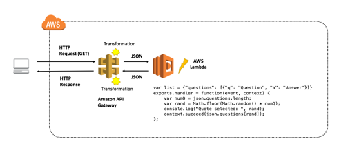

Introduction to Amazon API Gateway
==================================

Overview 
--------

In this lab, you will create a simple FAQ micro-service. The
micro-service will return a JSON object containing a random question and
answer pair using an **Amazon API Gateway** endpoint that invokes an
**AWS Lambda** function. Here is the architecture pattern for the
micro-service:



### Topics covered

By the end of this lab you will be able to:

-   Create an AWS Lambda function
-   Create an Amazon API Gateway endpoints
-   Debug API Gateway and Lambda with Amazon CloudWatch

### Prerequisites

Some programming experience and familiarity with application development
will be helpful, but not necessary to run the lab. You should however
have completed the *Introduction to AWS Lambda* self-paced lab before
this doing lab.

### Other AWS Services

Other AWS Services than the ones needed for this lab are disabled by IAM
policy during your access time in this lab. In addition, the
capabilities of the services used in this lab are limited to what is
required by the lab and in some cases are even further limited as an
intentional aspect of the lab design. Expect errors when accessing other
services or performing actions beyond those provided in this lab guide.

Technical Concepts 
------------------

### Microservice Architecture

*"The **microservice architectural style** is an approach to developing
a single application as a **suite of small services**, each running in
its own process and communicating with lightweight mechanisms, often an
HTTP resource API. These services are built around business capabilities
and independently deployable by fully automated deployment machinery.
There is a bare minimum of centralized management of these services,
which may be written in different programming languages and use
different data storage technologies."* -- [James Lewis and Martin
Fowler](https://martinfowler.com/microservices/)

The idea of a microservices architecture is to take a large, complex
system and break it down into **independent, decoupled services that are
easy to manage and extend**. This enables developers to meet their key
design goals like extensibility, availability and maintainability.

Amazon API Gateway and AWS Lambda provide the perfect combination of web
services to effortlessly build, deliver and maintain a suite of
microservices that can be the foundation of complex software systems.

In this lab, you will learn how to develop, deploy and debug a simple
microservice that represents one part of a much larger system. It will
consist of two pieces: the RESTful API and the function that is executed
when a user hits the endpoint.

### Application Programming Interface (API)

An **application programming interface** is a set of instructions that
defines how developers interface with an application. The idea behind an
API is to create a **standardized approach** to interfacing the various
services provided by an application. An API is designed to be used with
a **Software Development Kit (SDKs)**, which is a collection of tools
that allows developers to easily create downstream applications based on
the API.

### API-First Strategy

Many software organizations are adopting an **API-First strategy**,
where each service within their stack is first and always released as an
API. When designing a service, it is hard to know all of the various
applications that may want to utilize the service. For instance, the FAQ
service in this lab would be ideal to seed FAQ pages on an external
website. However, it is feasible to think that a cloud education company
would also want to ingest the FAQ within their training materials for
flash cards or training documents. If it was simply a static website,
the ingestion process for the education company would be very difficult.
By providing an API that can be *consumed in a standardized format*, the
microservice is enabling the development of an ecosystem around the
service, and use-cases that were not initially considered.

### RESTful API

Representational state transfer (REST) refers to architectures that
follow six constraints:

-   **Separation of concerns** via a client-server model.
-   **State** is stored entirely on the client and the communication
    between the client and server is **stateless**.
-   The client will **cache** data to improve network efficiency.
-   There is a uniform interface (in the form of an **API**) between the
    server and client.
-   As complexity is added into the system, **layers** are introduced.
    There may be multiple layers of RESTful components.
-   Follows a **code-on-demand** pattern, where code can be downloaded
    on the fly (in our case implemented in Lambda) and changed without
    having to update clients.

This lab is following a RESTful model. Clients send requests to backend
Lambda functions (server). The logic of service is encapsulated within
the Lambda function and it is providing a uniform interface for clients
to use.

### Best Practices for Building a RESTful API

A key goal of building an API is to help establish an **ecosystem of
innovation** around your set of services. Therefore, it is important to
make your API intuitive and easy-to-use. Here is a common naming and
method scheme to follow:

Operation

URL

Function

GET

/questions

Returns all of the questions

GET

/questions/17

Returns the question number 17

POST

/questions

Creates a new question

PUT

/questions/17

Updates question number 17

PATCH

/questions/17

Partially updates question number 17

DELETE

/questions/17

Deletes question number 17

Notice how to get a specific question, the API endpoint is *NOT*
*/question/name* but instead */questions/identifier*. This enables the
API designer to provide functionality to return groups of questions
(could be all questions) with the */questions* endpoint as well as
single record responses with the */questions/identifier*. For more
information, see the additional resources section at the end of this lab
guide.

A few good examples of RESTful APIs to look at are:

-   [The White
    House](https://github.com/WhiteHouse/api-standards#pragmatic-rest)
-   [Spotify](https://developer.spotify.com/web-api/)

### Amazon API Gateway and AWS Lambda

A microservice using Amazon API Gateway consists of a **defined
resource** and **associated methods** (GET, POST, PUT, etc.) in API
Gateway as well as the **backend target**. In this lab, the backend
target will be a Lambda function. However, the backend target could be
another HTTP endpoint (a third-party API or listening web server), an
AWS service proxy or a mock integration to be used as a placeholder.

### Amazon API Gateway

API Gateway is a managed service provided by AWS that makes creating,
deploying and maintaining APIs easy. API Gateway includes features to:

-   Transform the body and headers of incoming API requests to match
    backend systems
-   Transform the body and headers of the outgoing API responses to
    match API requirements
-   Control API access via Amazon Identity and Access Management
-   Create and apply API keys for third-party development
-   Enable Amazon CloudWatch integration for API monitoring
-   Cache API responses via Amazon CloudFront for faster response times
-   Deploy an API to multiple stages, allowing easy differentiation
    between development, test, production as well as versioning
-   Connect custom domains to an API
-   Define models to help standardize your API request and response
    transformations

### Amazon API Gateway and AWS Lambda Terminology

-   **Resource:** Represented as a URL endpoint and path. For example,
    *api.mysite.com/questions*. You can associate HTTP methods with
    resources and define different backend targets for each method. In a
    microservices architecture, a resource would represent a single
    microservice within your system.
-   **Method:** In API Gateway, a method is identified by the
    combination of a resource path and an HTTP verb, such as GET, POST,
    and DELETE.
-   **Method Request:** The method request settings in API gateway store
    the methods authorization settings and define the URL Query String
    parameters and HTTP Request Headers that are received from the
    client.
-   **Integration Request:** The integration request settings define the
    backend target used with the method. It is also where you can define
    mapping templates, to transform the incoming request to match what
    the backend target is expecting.
-   **Integration Response:** The integration response settings is where
    the mappings are defined between the response from the backend
    target and the method response in API Gateway. You can also
    transform the data that is returned from your backend target to fit
    what your end users and applications are expecting.
-   **Method Response:** The method response settings define the method
    response types, their headers and content types.
-   **Model:** In API Gateway, a model defines the format, also known as
    the schema or shape, of some data. You create and use models to make
    it easier to create mapping templates. Because API Gateway is
    designed to work primarily with JavaScript Object Notation
    (JSON)-formatted data, API Gateway uses JSON Schema to define the
    expected schema of the data.
-   **Stage:** In API Gateway, a stage defines the path through which an
    API deployment is accessible. This is commonly used to deviate
    between versions, as well as development vs production endpoints,
    etc.
-   **Blueprint:** A Lambda blueprint is an example lambda function that
    can be used as a base to build out new Lambda functions.

Start Lab
---------

-   Open https://808477742599.signin.aws.amazon.com/console
-   Enter login credentials

Task 1: Create a Lambda Function 
--------------------------------

3.  In the **AWS Management Console**, on the Services menu, click
    **Lambda**.

4.  Click Create a function

**Blueprints** are code templates for writing Lambda functions.
Blueprints are provided for standard Lambda triggers such as creating
Alexa skills and processing Amazon Kinesis Firehose streams. This lab
provides you with a pre-written Lambda function, so you will create your
function by using **Author from scratch**.

5.  Below **Author from scratch**, Configure:

-   **Function name:**
-   **Runtime:** *Node.js 8.10*
-   Expand **Choose or create an execution role**
-   **Execution role:** *Use an existing role*
-   **Existing role:** *lambda-basic-execution*
-   Click Create function

A page will be displayed with your function configuration.

6.  Scroll down to the **Function code** section and delete all of the
    code that appears in the code editor.

7.  Copy the code shown below and paste it into the index.js tab.

```
var json = {
  "service": "lambda",
  "reference": "https://aws.amazon.com/lambda/faqs/",
  "questions": [{
    "q": "What is AWS Lambda?",
    "a": "AWS Lambda lets you run code without provisioning or managing servers. You pay only for the compute time you consume - there is no charge when your code is not running. With Lambda, you can run code for virtually any type of application or backend service - all with zero administration. Just upload your code and Lambda takes care of everything required to run and scale your code with high availability. You can set up your code to automatically trigger from other AWS services or call it directly from any web or mobile app."
  },{
   "q":"What events can trigger an AWS Lambda function?",
   "a":"You can use AWS Lambda to respond to table updates in Amazon DynamoDB, modifications to objects in Amazon S3 buckets, logs arriving in Amazon CloudWatch logs, incoming emails to Amazon Simple Email Service, notifications sent from Amazon SNS, messages arriving in an Amazon Kinesis stream, client data synchronization events in Amazon Cognito, and custom events from mobile applications, web applications, or other web services. You can also invoke a Lambda function on a defined schedule using the AWS Lambda console."
  },{
   "q":"When should I use AWS Lambda versus Amazon EC2?",
   "a":"Amazon Web Services offers a set of compute services to meet a range of needs. Amazon EC2 offers flexibility, with a wide range of instance types and the option to customize the operating system, network and security settings, and the entire software stack, allowing you to easily move existing applications to the cloud. With Amazon EC2 you are responsible for provisioning capacity, monitoring fleet health and performance, and designing for fault tolerance and scalability. AWS Elastic Beanstalk offers an easy-to-use service for deploying and scaling web applications in which you retain ownership and full control over the underlying EC2 instances. Amazon Elastic Container Service is a scalable management service that supports Docker containers and allows you to easily run distributed applications on a managed cluster of Amazon EC2 instances. AWS Lambda makes it easy to execute code in response to events, such as changes to Amazon S3 buckets, updates to an Amazon DynamoDB table, or custom events generated by your applications or devices. With Lambda you do not have to provision your own instances; Lambda performs all the operational and administrative activities on your behalf, including capacity provisioning, monitoring fleet health, applying security patches to the underlying compute resources, deploying your code, running a web service front end, and monitoring and logging your code. AWS Lambda provides easy scaling and high availability to your code without additional effort on your part."
  },{
    "q":"What kind of code can run on AWS Lambda?",
    "a":"AWS Lambda offers an easy way to accomplish many activities in the cloud. For example, you can use AWS Lambda to build mobile back-ends that retrieve and transform data from Amazon DynamoDB, handlers that compress or transform objects as they are uploaded to Amazon S3, auditing and reporting of API calls made to any Amazon Web Service, and server-less processing of streaming data using Amazon Kinesis."
  },{
    "q":"What languages does AWS Lambda support?",
    "a":"AWS Lambda supports code written in Node.js (JavaScript), Python, and Java (Java 8 compatible). Your code can include existing libraries, even native ones. Lambda functions can easily launch processes using languages supported by Amazon Linux, including Bash, Go, and Ruby. Please read our documentation on using Node.js, Python and Java."
  },{
    "q":"Can I access the infrastructure that AWS Lambda runs on?",
    "a":"No. AWS Lambda operates the compute infrastructure on your behalf, allowing it to perform health checks, apply security patches, and do other routine maintenance."
  },{
    "q":"How does AWS Lambda isolate my code?",
    "a":"Each AWS Lambda function runs in its own isolated environment, with its own resources and file system view. AWS Lambda uses the same techniques as Amazon EC2 to provide security and separation at the infrastructure and execution levels."
  },{
    "q":"How does AWS Lambda secure my code?",
    "a":"AWS Lambda stores code in Amazon S3 and encrypts it at rest. AWS Lambda performs additional integrity checks while your code is in use."
  },{
    "q":"What is an AWS Lambda function?",
    "a":"The code you run on AWS Lambda is uploaded as a Lambda function. Each function has associated configuration information, such as its name, description, entry point, and resource requirements. The code must be written in a stateless style i.e. it should assume there is no affinity to the underlying compute infrastructure. Local file system access, child processes, and similar artifacts may not extend beyond the lifetime of the request, and any persistent state should be stored in Amazon S3, Amazon DynamoDB, or another Internet-available storage service. Lambda functions can include libraries, even native ones."
  },{
    "q":"Will AWS Lambda reuse function instances?",
    "a":"To improve performance, AWS Lambda may choose to retain an instance of your function and reuse it to serve a subsequent request, rather than creating a new copy. Your code should not assume that this will always happen."
  },{
    "q":"What if I need scratch space on disk for my AWS Lambda function?",
    "a":"Each Lambda function receives 500MB of non-persistent disk space in its own /tmp directory."
  },{
    "q":"Why must AWS Lambda functions be stateless?",
    "a":"Keeping functions stateless enables AWS Lambda to rapidly launch as many copies of the function as needed to scale to the rate of incoming events. While AWS Lambda's programming model is stateless, your code can access stateful data by calling other web services, such as Amazon S3 or Amazon DynamoDB."
  },{
    "q":"Can I use threads and processes in my AWS Lambda function code?",
    "a":"Yes. AWS Lambda allows you to use normal language and operating system features, such as creating additional threads and processes. Resources allocated to the Lambda function, including memory, execution time, disk, and network use, must be shared among all the threads/processes it uses. You can launch processes using any language supported by Amazon Linux."
  },{
    "q":"What restrictions apply to AWS Lambda function code?",
    "a":"Lambda attempts to impose few restrictions on normal language and operating system activities, but there are a few activities that are disabled: Inbound network connections are managed by AWS Lambda, only TCP/IP sockets are supported, and ptrace (debugging) system calls are restricted. TCP port 25 traffic is also restricted as an anti-spam measure."
  },{
    "q":"How do I create an AWS Lambda function using the Lambda console?",
    "a":"You can author the code for your function using the inline editor in the AWS Lambda console. You can also package the code (and any dependent libraries) as a ZIP and upload it using the AWS Lambda console from your local environment or specify an Amazon S3 location where the ZIP file is located. Uploads must be no larger than 50MB (compressed). You can use the AWS Eclipse plugin to author and deploy Lambda functions in Java and Node.js. If you are using Node.js, you can author the code for your function using the inline editor in the AWS Lambda console. Go to the console to get started."
  },{
    "q":"How do I create an AWS Lambda function using the Lambda CLI?",
    "a":"You can package the code (and any dependent libraries) as a ZIP and upload it using the AWS CLI from your local environment, or specify an Amazon S3 location where the ZIP file is located. Uploads must be no larger than 50MB (compressed). Visit the Lambda Getting Started guide to get started."
  },{
    "q":"Which versions of Python are supported?",
    "a":"Lambda provides a Python 2.7-compatible runtime to execute your Lambda functions. Lambda will include the latest AWS SDK for Python (boto3) by default."
  },{
    "q":"How do I compile my AWS Lambda function Java code?",
    "a":"You can use standard tools like Maven or Gradle to compile your Lambda function. Your build process should mimic the same build process you would use to compile any Java code that depends on the AWS SDK. Run your Java compiler tool on your source files and include the AWS SDK 1.9 or later with transitive dependencies on your classpath. For more details, see our documentation."
  },{
    "q":"What is the JVM environment Lambda uses for execution of my function?",
    "a":"Lambda provides the Amazon Linux build of openjdk 1.8."
  }
  ]
}

exports.handler = function(event, context) {
    var rand = Math.floor(Math.random() * json.questions.length);
    console.log("Quote selected: ", rand);

    var response = {
        body: JSON.stringify(json.questions[rand])
    };
    console.log(response);
    context.succeed(response);
};
```

Examine the code. It is performs the following steps:

-   Defines a list of Frequently Asked Questions (FAQs)
-   Returns a random FAQ

8.  Scroll down to the **Basic settings** section.

9.  For **Description**, enter:

AWS Lambda functions can be **triggered** automatically by activities
such as data being received by Amazon Kinesis or data being updated in
an Amazon DynamoDB database. For this lab, you will trigger the Lambda
function whenever a call is made to API Gateway.

10. Scroll up to the **Designer** section.

11. Under **Add triggers**, click **API Gateway**.

You will create an API Gateway endpoint.

** An API endpoint refers to a host name of the API. The API endpoint
can be edge-optimized or regional, depending on where the majority of
your API traffic originates from. You choose a specific endpoint type
when creating an API.

12. In the **Configure triggers** section configure:

-   **API:** *Create a new API*
-   **Security:** *Open*
-   Expand **Additional settings**
-   **API name:**
-   **Deployment stage:**

13. At the bottom right-side of the screen, click Add.

14. Click Save at the top right corner.

** You have successfully created the Lambda function. This has also
created a default API Gateway that will trigger the Lambda function.

Task 2: Test the Lambda function 
--------------------------------

You will be presented with the FAQ Lambda function page.

15. Under **API Gateway**, click the right arrow ** to view the details
    of your API.

16. Copy the **API endpoint** to your clipboard, then:

-   In a new browser tab, paste the **API endpoint**
-   Press **Enter** to go to the URL

A new browser tab will open. You should see a random FAQ entry, such as:


The Lambda function can also be tested in isolation.

17. Close the FAQ browser tab and return to the web browser tab showing
    the Lambda Management Console.

18. At the top of the screen, Click Test then configure:

-   **Event name:**
-   Delete the provided keys and values, retaining an empty **{}** to
    represent an empty JSON object:

```
{}
```

19. At the bottom of the screen, click Create

20. At the top of screen, Click Test

21. In the **Execution result: succeeded** window, expand **
    **Details**.

The output shows the FAQ entry wrapped inside a *body* parameter.

Below the Execution result are two columns. The *Summary* displays the
total execution time for the Lambda function and the resources consumed.
The *Log output* displays logging information. In this section, you will
see any console logging as well as any error messages.

22. Click the **Monitoring** tab.

23. Click View logs in CloudWatch

24. Click on one of the log streams.

You will be presented with the same event data that was displayed in the
Lambda Management Console. Examine the contents of each line to view the
log information.

Conclusion 
----------

Congratulations! You have completed this lab and have successfully
created a microservice with Amazon API Gateway and AWS Lambda. You now
know how to:

-   Create an AWS Lambda function
-   Create an Amazon API Gateway endpoints
-   Debug API Gateway and Lambda with Amazon CloudWatch

End Lab 
-------

Follow these steps to close the console, end your lab, and evaluate the
experience.

25. Return to the AWS Management Console.

26. On the navigation bar, click **\<yourusername\>@\<AccountNumber\>**,
    and then click **Sign Out**.

27. Click End Lab

28. Click OK

29. (Optional):

-   Select the applicable number of stars **
-   Type a comment
-   Click **Submit**

    -   1 star = Very dissatisfied
    -   2 stars = Dissatisfied
    -   3 stars = Neutral
    -   4 stars = Satisfied
    -   5 stars = Very satisfied

You may close the dialog if you don't want to provide feedback.

Next Steps 
----------

This lab was intended to provide an introduction into microservices
architecture patterns, why they are important and how to set up a basic
open API.

Now that you have completed the lab, take it a step further! Here are
some additional things you could do to extend the functionality of your
microservice in your own AWS account:

-   Control access to your endpoint by integrating AWS IAM.
-   Move the JSON object with the questions into a data store like
    DynamoDB.
-   Implement a URL parameter that will return a specific question.
-   Implement an endpoint that returns all questions.
-   Implement a new method that adds a question into the list.
-   Checkout serverless development frameworks like
    [Apex](https://github.com/apex/apex) or
    [Serverless](https://github.com/serverless/serverless).

Additional Resources [step9]
--------------------

-   [Best Practices for a Pragmatic RESTful
    API](http://www.vinaysahni.com/best-practices-for-a-pragmatic-restful-api)
-   [Amazon API Gateway
    Documentation](http://docs.aws.amazon.com/apigateway/latest/developerguide/welcome.html)
-   [Amazon Lambda
    Documentation](http://docs.aws.amazon.com/lambda/latest/dg/welcome.html)
-   [Microservice Architecture patterns and best
    practices](http://microservices.io/index.html)
-   [Representational State
    Transfer](https://www.ics.uci.edu/~fielding/pubs/dissertation/rest_arch_style.htm)
-   [Creating an API
    Endpoint](https://docs.aws.amazon.com/apigateway/latest/developerguide/how-to-create-api.html)

For feedback, suggestions, or corrections, please email us at
[*aws-course-feedback@amazon.com*](mailto:aws-course-feedback+spl@amazon.com).

[Overview](https://run.qwiklabs.com/focuses/269?parent=catalog#step1)[Technical
Concepts](https://run.qwiklabs.com/focuses/269?parent=catalog#step2)[Start
Lab](https://run.qwiklabs.com/focuses/269?parent=catalog#step3)[Task 1:
Create a Lambda
Function](https://run.qwiklabs.com/focuses/269?parent=catalog#step4)[Task
2: Test the Lambda
function](https://run.qwiklabs.com/focuses/269?parent=catalog#step5)[Conclusion](https://run.qwiklabs.com/focuses/269?parent=catalog#step6)[End
Lab](https://run.qwiklabs.com/focuses/269?parent=catalog#step7)[Next
Steps](https://run.qwiklabs.com/focuses/269?parent=catalog#step8)[Additional
Resources](https://run.qwiklabs.com/focuses/269?parent=catalog#step9)

#### Ready for more? {.headline-3}

Here's another lab we think you'll like.

[](https://run.qwiklabs.com/focuses/363?parent=catalog)

Hands-On Lab

### Creating an Amazon Virtual Private Cloud (VPC) with AWS CloudFormation {.card--content__title}

This lab will demonstrate how to create an Amazon Virtual Private Cloud
(VPC) network using AWS CloudFormation. Note: This lab is a more of a
walkthrough of a template rather than "learn how to build it". You will
walk through the sections of an AWS CloudFormation template and get
explanations for each step. You will then launch the AWS CloudFormation
template to create a four-subnet Amazon VPC that spans two Availability
Zones and a NAT that allows servers in the private subnets to
communicate with the Internet in order to download packages and updates.

Fundamental

Welcome to Your First Lab! {.headline-1}
==========================

close

Skip this video

In this lab, you will create a simple FAQ microservice. The microservice
will return a JSON object containing a random question and answer pair
using an API Gateway endpoint that invokes a Lambda function.
Prerequisites: students should take the lab "Introduction to AWS Lambda"
before taking this lab.

This lab is included in these quests: [Serverless Web Apps using Amazon
DynamoDB](https://run.qwiklabs.com/quests/21), [Developer -
Associate](https://run.qwiklabs.com/quests/20), [Serverless Design with
AWS Lambda](https://run.qwiklabs.com/quests/17). If you complete this
lab you'll receive credit for it when you enroll in one of these quests.

**Duration:** 0m setup · 55m access · 35m completion

**AWS Region:** [us-west-2] **US West (Oregon)**

**Levels:**introductory

**Permalink:**
[https://run.qwiklabs.com/catalog\_lab/236](https://run.qwiklabs.com/catalog_lab/236)

Got It

How satisfied are you with this lab?\*

Comment

Cancel
