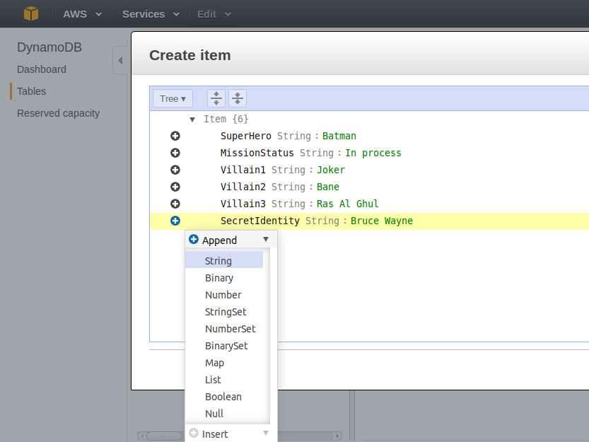

Serverless Web Apps using Amazon DynamoDB - Part 1
==================================================

- Overview
- Start Lab
- Task 1: Create Your DynamoDB Table
- Task 2: Add Items via Tree Method
- Task 3: Add Items via JSON
- Task 4: Review IAM Policies and Roles
- End Lab

Overview 
--------

Calling all AWS super heroes! Build a mission dossier generator using
DynamoDB in this three-part series of labs using DynamoDB. You hold in
your hands step-by-step instructions for completing Part 1. In this lab,
you will build the infrastructure you will need in the next two labs.
You will create a DynamoDB table and add data, and then review the
necessary IAM roles and policies that you will use to grant secure
access to this data.

In labs 2 and 3, you will create Lambda functions that interact with
DynamoDB, build an API through the API Gateway service, and finally
publish an app to the public web, utilizing all of the DynamoDB skills
you learn through the three labs. At the end of part 3, you will be able
to generate mission dossiers and send super heroes off to save the
world!

### Topics covered

By the end of this lab you will be able to:

-   Create an Amazon DynamoDB table
-   Add items to your Amazon DynamoDB table
-   Understand the structure of IAM roles and policies needed to access
    your table

### Prerequisites

You should familiarize yourself with key concepts by taking the
[Introduction to Amazon
DynamoDB](https://s3-us-west-2.amazonaws.com/searches/lab?keywords=Introduction%20to%20Amazon%20DynamoDB)
and [Introduction to AWS Identity and Access Management
(IAM)](https://s3-us-west-2.amazonaws.com/searches/lab?keywords=Introduction%20to%20AWS%20Identity)
labs. This is the first in a three-part series of labs. Each of the
three labs can stand alone, but because the labs build upon what you
learned previously, taking all three in order is the best learning
experience.

### Other AWS Services

Other AWS Services than the ones needed for this lab are disabled by IAM
policy during your access time in this lab. In addition, the
capabilities of the services used in this lab are limited to what’s
required by the lab and in some cases are even further limited as an
intentional aspect of the lab design. Expect errors when accessing other
services or performing actions beyond those provided in this lab guide.

### Amazon DynamoDB

Amazon DynamoDB is a fast and flexible NoSQL database service for all
applications that need consistent, single-digit millisecond latency at
any scale. It is a fully managed cloud database and supports both
document and key-value store models. Its flexible data model and
reliable performance make it a great fit for mobile, web, gaming, ad
tech, IoT, and many other applications.

You can use Amazon DynamoDB to create a database table that can store
and retrieve any amount of data, and serve any level of request traffic.
Amazon DynamoDB automatically spreads the data and traffic for the table
over a sufficient number of servers to handle the request capacity
specified by the customer and the amount of data stored, while
maintaining consistent and fast performance.

### DynamoDB Terminology

**Tables**\
 Similar to other database management systems, DynamoDB stores data in
tables. A table is a collection of data. For example, in this lab you
will create a table named SuperMission, where you will store mission
information. You could also have a People table to store data about
friends, family, or anyone else of interest, or a Cars table to store
information about vehicles that people drive.

**Items**\
 Each table contains multiple items. An item is a group of attributes
that is uniquely identifiable among all of the other items. In a People
table, each item would represent one person. For a Cars table, each item
represents one vehicle. Items are similar in many ways to rows, records,
or tuples in relational database systems. In DynamoDB, there is no limit
to the number of items that you can store in a table.

**Attributes**\
 Each item is composed of one or more attributes. An attribute is a
fundamental data element, something that does not need to be broken down
any further. In this lab, you will create a Mission item with attributes
like SuperHero, MissionStatus, Villain1, Villain2, Villain3 and
SecretIdentity. As another example, a Department item might have
attributes such as DepartmentID, Name, Manager, and so on. An item in a
People table could contain attributes such as PersonID, LastName,
FirstName, and so on. Attributes in DynamoDB are similar in many ways to
fields or columns in other database management systems.

**Primary Key**\
 When you create a table, in addition to the table name, you must
specify the primary key of the table. As in other databases, a primary
key in DynamoDB uniquely identifies each item in the table, so that no
two items can have the same key. When you add, update, or delete an item
in the table, you must specify the primary key attribute values for that
item. The key values are required; you cannot omit them. DynamoDB
supports two different kinds of primary keys: **Partition Key** and
**Partition Key and Sort Key**.

**Secondary Indexes**\
 In DynamoDB, you can read data in a table by providing primary key
attribute values. If you want to read the data using non-key attributes,
you can use a secondary index to do this. After you create a secondary
index on a table, you can read data from the index in much the same way
as you do from the table. By using secondary indexes, your applications
can use many different query patterns, in addition to accessing the data
by primary key values.

### AWS Identity and Access Management Documentation

AWS Identity and Access Management (IAM) is a web service that enables
Amazon Web Services (AWS) customers to manage users and user permissions
in AWS. The service is targeted at organizations with multiple users or
systems in the cloud that use AWS products such as Amazon DynamoDB, AWS
Lambda, and the AWS Management Console. With IAM, you can centrally
manage users, security credentials such as access keys, and permissions
that control which AWS resources users can access. For more information,
see [https://aws.amazon.com/iam/](https://aws.amazon.com/iam/).

### AWS Lambda

AWS Lambda is a compute service that provides resizable compute capacity
in the cloud to make web-scale computing easier for developers. Upload
your code to AWS Lambda and AWS Lambda takes care of provisioning and
managing the servers that you use to run the code. AWS Lambda supports
multiple coding languages: Node.js, Java, or Python.\
 You can use AWS Lambda in two ways:

-   As an event-driven compute service where AWS Lambda runs your code
    in response to events, such as uploading image files as you’ll see
    in this lab.
-   As a compute service to run your code in response to HTTP requests
    using Amazon API Gateway or API calls.

AWS Lambda passes on the financial benefits of Amazon’s scale to you.
Lambda executes your code only when needed and scales automatically,
from a few requests per day to thousands per second. Lambda makes it
easy to build data processing triggers for AWS services like Amazon S3
and Amazon DynamoDB, process streaming data stored in Amazon Kinesis, or
create your own back end that operates at AWS scale, performance, and
security.

This lab guide explains basic concepts of AWS in a step by step fashion.
However, it can only give a brief overview of Lambda concepts. For
further information, see the official Amazon Web Services Documentation
for Lambda at
[https://aws.amazon.com/documentation/lambda/](https://aws.amazon.com/documentation/lambda/).
For pricing details, see
[https://aws.amazon.com/lambda/pricing/](https://aws.amazon.com/lambda/pricing/).

Start Lab
---------

-   Open https://808477742599.signin.aws.amazon.com/console
-   Enter login credentials


Task 1: Create Your DynamoDB Table 
----------------------------------

3.  In the **AWS Management Console**, on the Services menu, click
    **DynamoDB**.

4.  Click Create table then configure:

-   **Table name:**
-   **Primary key:**
    -   -   *String*

You will use the default settings to create the table.

5.  Click Create

The table will only take a few seconds to create. If your browser
takes longer than this, click **Cancel** and refresh the web page. Your
table should appear.

Congratulations! You created a DynamoDB table.

Task 2: Add Items via Tree Method 
---------------------------------

In this task, you will add items to the table using the Tree method.

6.  Once the table creation process is complete:

-   Click the **Items** tab
-   Click Create item

7.  Confirm that **Tree** is selected in the top-left of the *Create
    item* dialog box.

The first item **Field** is already populated for you with *SuperHero*.

8.  For **Value**, enter:

9.  Add the next attribute by clicking the ** symbol, then:

-   Clicking **Append**
-   Selecting **String**

10. Using the table below, enter each item as **Field** and **Value**,
    one at a time. To add the next attribute, click **, click
    **Append**, then click **String**.

Field | Value
--- | ---
`SuperHero` | Batman
`MissionStatus` |  In progress
`Villain1` | Joker
`Villain2` | Bane
`Villain3` | Ras Al Ghul
`SecretIdentity` | Bruce Wayne

When you finish, your item should look similar to:



11. Click Save

Task 3: Add Items via JSON 
--------------------------

In this task, you will add an item as JSON.

12. Click Create Item then configure:

-   Click **Tree**
-   Select **Text**

13. Delete all text in the editor.

14. Copy and paste this JSON code into the editor:

```
{
    "SuperHero": "Superman",
    "Villain1": "Doomsday",
    "Villain2": "General Zod",
    "Villain3": "Lex Luthor",
    "MissionStatus": "In progress",
    "SecretIdentity": "Clark Kent"
}
```

15. Click Save

16. Repeat the above steps to enter the third and fourth items.

**Third item:**

```
{
    "SuperHero": "The Winchester Brothers",
    "Villain1": "Vampires",
    "Villain2": "Ghosts",
    "Villain3": "Werewolves",
    "MissionStatus": "Complete",
    "SecretIdentity": "Sam and Dean"
}
```

**Fourth item:**

```
{
    "SuperHero": "Iron Man",
    "Villain1": "Apocalypse",
    "Villain2": "Doctor Doom",
    "Villain3": "Loki",
    "MissionStatus": "In progress",
    "SecretIdentity": "Tony Stark"
}
```

Congratulations! You learned how to enter data into a DynamoDB table
using the AWS Management Console, using two different methods.

Task 4: Review IAM Policies and Roles 
-------------------------------------

In this task you will review the two IAM policies that will be used to
access your data in the next lab. These policies have already been
pre-created for you as part of the lab environment.

17. On the Services menu, click **IAM**.

18. In the left navigation pane, click **Roles**.

19. Click the role named **SuperDynamoDBScanRole**.

20. Expand **SuperDynamoDBScanPolicy**.

Details of the policy will appear.

21. Click **{ } JSON**.

The policy will look similar to:

```
{
    "Version": "2012-10-17",
    "Statement": [
        {
            "Action": [
                "dynamodb:Scan",
                "s3:GetObject",
                "s3:PutObject",
                "dynamodb:BatchWriteItem"
            ],
            "Resource": [
                "*"
            ],
            "Effect": "Allow"
        }
    ]
}
```

This is a simple policy that grants access to the Scan, BatchWriteItem
APIs under DynamoDB and GetObject, PutObject APIs under S3 in your
account.

22. In the left navigation pane, click **Roles**.

23. Click the role named **SuperDynamoDBQueryRole**.

24. Expand **SuperDynamoDBQueryPolicy**.

Details of the policy will appear.

The policy will look similar to:

```
{
    "Version": "2012-10-17",
    "Statement": [
        {
            "Condition": {
                "ForAllValues:StringEquals": {
                    "dynamodb:Attributes": [
                        "SuperHero",
                        "MissionStatus",
                        "Villain1",
                        "Villain2",
                        "Villain3"
                    ]
                }
            },
            "Action": [
                "dynamodb:Query"
            ],
            "Resource": "*",
            "Effect": "Allow"
        }
    ]
}
```

This policy allows the user or entity that assumes the role to perform a
Query operation, but only against the specified attributes. This
powerful feature enables you to implement column-level security on your
DynamoDB tables. You will use this role in the next lab to enable an AWS
Lambda function to read data from this table.

Congratulations! You have successfully prepared the infrastructure
necessary to complete the tasks in the next lab. You created an Amazon
DynamoDB table, learned how to add different types of items to your
table, and reviewed IAM policies and roles that you will use later to
query the data.

Conclusion 
----------

Congratulations! You have completed this lab. You now know how to:

-   Create an Amazon DynamoDB table
-   Create different types of items in the table
-   Secure access to your DynamoDB tables using IAM policies and roles

End Lab 
-------

Follow these steps to close the console, end your lab, and evaluate the
experience.

25. Return to the AWS Management Console.

26. On the navigation bar, click **\<yourusername\>@\<AccountNumber\>**,
    and then click **Sign Out**.

27. Click End Lab

28. Click OK

29. (Optional):

-   Select the applicable number of stars **
-   Type a comment
-   Click **Submit**

    -   1 star = Very dissatisfied
    -   2 stars = Dissatisfied
    -   3 stars = Neutral
    -   4 stars = Satisfied
    -   5 stars = Very satisfied

You may close the dialog if you don't want to provide feedback.

### What Next?

Now that you have completed the lab, continue your mission to save the
world with the next lab in the series with **Serverless Web Apps Using
Amazon DynamoDB - Part 2**. In the next lab, you will leverage the
DynamoDB table that you created.

### Additional Resources

-   [Amazon DynamoDB
    Documentation](https://aws.amazon.com/documentation/dynamodb/)
-   [Amazon DynamoDB Pricing](https://aws.amazon.com/dynamodb/pricing/)
-   [AWS Identity and Access Management
    Documentation](https://aws.amazon.com/documentation/iam/)
-   [AWS Lambda Developer
    Guide](http://docs.aws.amazon.com/lambda/latest/dg/welcome.html)
