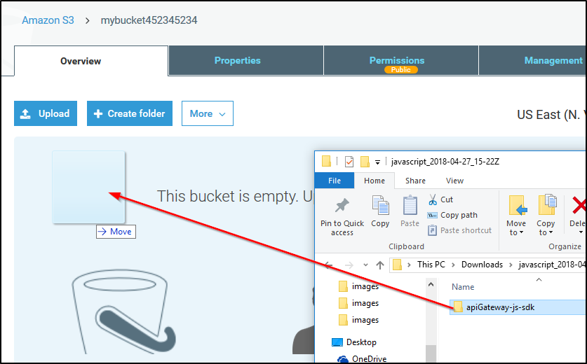

Serverless Web Apps using Amazon DynamoDB - Part 3
==================================================

- Overview
- Topics covered
- Lab Pre-requisites
- Other AWS Services
- Task 1: Verify Your Region
- Task 2: Verify Resources
- Task 3: Create and Deploy an API
- Task 4: Generate the SDK For Your API
- Task 5: Publish With S3
- End Lab

Overview 
--------

Complete your mission! In this lab, you will complete and publish a
mission dossier generator using DynamoDB. This is Part 3 of a three-part
series of labs. In Part 1, you created a DynamoDB table and entered
mission data. In Part 2, you created and tested Lambda functions to
retrieve mission data. In Part 3, you will conclude this three-part
series by configuring an API using Amazon API Gateway and setting up a
public website to retrieve information from your DynamoDB table via
Lambda functions, using what you learned in all three labs to send super
heroes off to save the world!

Topics covered 
--------------

By the end of this lab you will be able to:

-   Create an API for Lambda functions to access a DynamoDB table using
    Amazon API Gateway
-   Generate the SDK for your API
-   Configure and publish content with Amazon S3

... and give super heroes details about the missions they face!

Lab Pre-requisites 
------------------

You should familiarize yourself with key concepts by taking the
[Introduction to Amazon
DynamoDB](https://s3-us-west-2.amazonaws.com/searches/lab?keywords=Introduction%20to%20Amazon%20DynamoDB)
lab. This is the third in a three-part series of labs. Each of the three
labs can stand alone, but because the labs build upon what you learned
previously, taking [Serverless Web Apps using Amazon DynamoDB - Part
1](https://s3-us-west-2.amazonaws.com/searches/lab?keywords=Serverless%20Web%20Apps%20using%20Amazon%20DynamoDB%20-%20Part%201)
and [Serverless Web Apps using Amazon DynamoDB - Part
2](https://s3-us-west-2.amazonaws.com/searches/lab?keywords=Serverless%20Web%20Apps%20using%20Amazon%20DynamoDB%20-%20Part%202)
prior to this lab is the best learning experience.

The qwikLABS lab environment is not accessible using an iPad or tablet
device, but you can use these devices to view the lab instructions.

Other AWS Services 
------------------

Other AWS Services than the ones needed for this lab are disabled by an
IAM policy during your access time in this lab. In addition, the
capabilities of the services used in this lab are limited to what’s
required by the lab and in some cases are even further limited as an
intentional aspect of the lab design. Expect errors when accessing other
services or performing actions beyond those provided in this lab guide.

**Amazon DynamoDB**

Amazon DynamoDB is a fast and flexible NoSQL database service for all
applications that need consistent, single-digit millisecond latency at
any scale. It is a fully managed cloud database and supports both
document and key-value store models. Its flexible data model and
reliable performance make it a great fit for mobile, web, gaming, ad
tech, IoT, and many other applications.

You can use Amazon DynamoDB to create a database table that can store
and retrieve any amount of data, and serve any level of request traffic.
Amazon DynamoDB automatically spreads the data and traffic for the table
over a sufficient number of servers to handle the request capacity
specified by the customer and the amount of data stored, while
maintaining consistent and fast performance.

For more information about Amazon DynamoDB, see
[https://aws.amazon.com/documentation/dynamodb/](https://aws.amazon.com/documentation/dynamodb/).
For pricing, see
[https://aws.amazon.com/dynamodb/pricing/](https://aws.amazon.com/dynamodb/pricing/).

**AWS Lambda**

AWS Lambda is a compute service that provides resizable compute capacity
in the cloud to make web-scale computing easier for developers. Upload
your code to AWS Lambda and AWS Lambda takes care of provisioning and
managing the servers that you use to run the code. AWS Lambda supports
multiple coding languages: Node.js, Java, or Python.\
 You can use AWS Lambda in two ways:

-   As an event-driven compute service where AWS Lambda runs your code
    in response to events, such as uploading image files as you’ll see
    in this lab.
-   As a compute service to run your code in response to HTTP requests
    using Amazon API Gateway or API calls.

AWS Lambda passes on the financial benefits of Amazon’s scale to you.
Lambda executes your code only when needed and scales automatically,
from a few requests per day to thousands per second. Lambda makes it
easy to build data processing triggers for AWS services like Amazon S3
and Amazon DynamoDB, process streaming data stored in Amazon Kinesis, or
create your own back end that operates at AWS scale, performance, and
security.

This lab guide explains basic concepts of AWS in a step by step fashion.
However, it can only give a brief overview of Lambda concepts. For
further information, see the official Amazon Web Services Documentation
for Lambda at
[https://aws.amazon.com/documentation/lambda/](https://aws.amazon.com/documentation/lambda/).\
 For pricing details, see
[https://aws.amazon.com/lambda/pricing/](https://aws.amazon.com/lambda/pricing/).

**Amazon API Gateway**

Amazon API Gateway is a fully managed service that makes it easy for
developers to create, publish, maintain, monitor, and secure APIs at any
scale. With a few clicks in the AWS Management Console, you can create
an API that acts as a "front door" for applications to access data,
business logic, or functionality from your back-end services. You can
use it with workloads running on Amazon Elastic Compute Cloud (Amazon
EC2), code running on AWS Lambda (as you will see in this lab), or any
Web application. Amazon API Gateway handles all the tasks involved in
accepting and processing up to hundreds of thousands of concurrent API
calls, including traffic management, authorization and access control,
monitoring, and API version management.

For documentation, see
[https://aws.amazon.com/documentation/apigateway/](https://aws.amazon.com/documentation/apigateway/).
For pricing details, see
[https://aws.amazon.com/api-gateway/pricing/](https://aws.amazon.com/api-gateway/pricing/).

Start Lab
---------

-   Open https://808477742599.signin.aws.amazon.com/console
-   Enter login credentials

Task 1: Verify Your Region 
--------------------------

With Amazon EC2, you can place instances in multiple locations. Amazon
EC2 locations are composed of *regions* that contain *Availability
Zones*. Regions are dispersed and located in separate geographic areas
(US, EU, etc.). In this case, your lab is configured to run in US East
(N. Virginia) because the lab requires resources that are only available
in certain regions. For more information about regions, see
[http://docs.aws.amazon.com/general/latest/gr/rande.html](http://docs.aws.amazon.com/general/latest/gr/rande.html).

The AWS region name is always listed in the upper-right corner of the
AWS Management Console, in the navigation bar. This lab is configured to
run in US East (N. Virginia). If your region is something different,
click the region name and select "N. Virginia".


**Important** Make sure your region is set to "N. Virginia".

Task 2: Verify Resources 
------------------------

3.  In the **AWS Management Console**, on the Services menu, click
    **CloudFormation**.

You should see one stack with a status of **CREATE\_IN\_PROGRESS**.

4.  Wait for the status to change to **CREATE\_COMPLETE** before you
    proceed.

** If you do not see a stack being created, double check that you are in
the "N. Virginia" region. The CloudFormation template is preparing what
you need to complete this lab. It may take a few minutes for all the
resources to be ready. While you wait, you can observe the creation
process for the following resources.


### Verify Your DynamoDB Table

5.  On the Services menu, click **DynamoDB**.

6.  In the left navigation pane, click **Tables**.

You will see a table named *SuperMission* in the process of being
created. Once the *SuperMission* DynamoDB table has been created, you
will see that items have been added to the table.

### Verify Your Lambda Functions

7.  On the Services menu, click **Lambda**.

The items in the DynamoDB table were added by a Lambda function, which
you can see in the Lambda Console. You will also see two more Lambda
functions, **getheroeslist** and **getmissiondetails**, which you will
recognize from taking the Part 2 lab.


### Verify Your IAM Policies and Roles

Two IAM roles and two IAM policies have been created for you.

8.  On the Services menu, click **IAM**.

9.  In the left navigation pane, click **Roles**.

You will see two IAM roles: *SuperDynamoDBScanRole* and
*SuperDynamoDBQueryRole*.

10. Click on the **SuperDynamoDBQueryRole**, then:

-   Notice that the **SuperDynamoDBQueryPolicy** is attached to the
    **SuperDynamoDBQueryRole**
-   What does this policy allow?

11. Click on the **SuperDynamoDBScanRole**, then:

-   Notice that the **SuperDynamoDBScanPolicy** is attached to the
    **SuperDynamoDBScanRole**
-   What does this policy allow?

Task 3: Create and Deploy an API 
--------------------------------

In this task of the lab, you will learn how to create and configure a
new API. Amazon API Gateway helps developers to create and manage APIs
to back-end systems running on Amazon EC2, AWS Lambda, or any
public-facing web service. In this lab, you will create and configure an
API to connect your DynamoDB table to your Lambda functions.

12. On the Services menu, click **API Gateway**.

13. Click Get Started

### Create Your API

14. On the **Create Example API** screen, click OK

This example API is prepopulated for you by AWS. It is a good reference
if you are new to working with Amazon API Gateway, but you will not use
this example for your lab.

15. Click the **New API** radio button, then configure:

-   **API name:**
-   **Description:**
-   Click Create API

You will see what looks like a file explorer.

16. Click **/**

This is the root of the folder.

### Create Your Getheroeslist Resources

17. On the Actions menu, click **Create Resource**, then configure:

-   **Resource Name:**
-   Click Create Resource

Next you will create another child resource.

18. Click **/** (again, the root of the folder).

19. On the Actions menu, click click **Create Resource**, then
    configure:

-   **Resource Name:**
-   Click Create Resource

### Create getheroeslist Method

Next you will create the methods to call the Lambda functions you
created in Part 2 of this series of labs. Recall that the Lambda
functions pull mission data from the DynamoDB table in several different
ways.

20. Click **getheroeslist** resource.

21. On the Actions menu, click **Create Method**, then configure:

-   Click the drop-down ** arrow and select **POST**
-   Click the **check mark** next to **POST**

Next you will set up your method.

In the **Post - Setup** window, configure:

-   **Integration type:** **Lambda Function**
-   **Lambda Region:** *us-east-1*
-   **Lambda Function:**
-   Click Save

You will see a warning that you are about to give the API Gateway
service permission to invoke your Lambda function.

22. Click OK

### Create getmissiondetails Method

23. Click the **getmissiondetails** resource.

24. On the Actions menu, click **Create Method**, then configure:

-   Click the drop-down ** arrow and select **POST**.
-   Click the **check mark** next to **POST**.

In the **Post - Setup** window, configure:

-   **Integration type:** **Lambda Function**
-   **Lambda Region:** *us-east-1*
-   **Lambda Function:**
-   Click Save

You will see the same warning.

25. Click OK

Next, you will enable CORS for the methods you just created in the API
Gateway. Cross-Origin Resource Sharing (CORS) allows browsers to make
HTTP requests to servers with a different domain/origin.

### Enable CORS For getheroeslist

26. Click the **getheroeslist** resource.

27. On the Actions menu, click **Enable CORS**, then configure:

-   Ensure **Post** and **Options**, are selected
-   Click Enable CORS and replace existing CORS headers

28. Click Yes, replace existing values

### Enable CORS for getmissiondetails

29. Click the **getmissiondetails** resource.

30. On the Actions menu, click **Enable CORS**, then configure:

-   Ensure **Post** and **Options**, are selected.
-   Click Enable CORS and replace existing CORS headers

31. Click Yes, replace existing values

32. Click the root folder, **/**.

33. On the Actions menu, click **Deploy API**, then configure:

-   **Deployment stage:** *New Stage*
-   **Stage name:**
-   Click Deploy

** Congratulations, you have deployed the API!

Task 4: Generate the SDK For Your API [step9]
-------------------------------------

In this task, you will generate the SDK for your API. After deploying
the API, you will be redirected to the Demo1 Stage Editor.

34. On the stage editor, click the **SDK Generation** tab, then
    configure:

-   **Platform:** *Javascript*
-   Click Generate SDK

35. Save the zip file to a location on your computer.

36. Extract the content of the JavaScript zip file you downloaded.

Next, you will retrieve an HTML page that you will use to test your API.

37. Copy this the following link into a new browser tab:

```
https://s3-us-west-2.amazonaws.com/us-west-2-aws-training/awsu-spl/spl134-dynamodb-webapp-part3/static/index.html
```

38. Press **Enter** to go to the page.

39. In your browser, type **Ctrl + S** on your keyboard (Windows) or
    **Command + S** (Mac) to save the web page as HTML.

40. Save the HTML file as index.html and place it in the
    **apiGateway-js-sdk** folder.

**Important** When you save the index.html file, make sure you save it
as a web page, **HTML only**. You only need the HTML of this page.

Recall that you downloaded the ZIP file and extracted the contents to
your local computer in previous steps.

41. Open index.html in your browser.

42. Using the index web page, retrieve mission details.

43. Review the output.


You will notice that the drop-down list uses the API Gateway resource
**getheroeslist** to invoke the **getheroeslistFunction** Lambda
function.

**Note** To retrieve mission details using the index web page, select
the Super Hero name in the drop down list and then click **GO** to
display the Mission Status and Mission Dossier

44. Challenge yourself! Identify which API Gateway resources and Lambda
    functions are invoked to return results for **Mission Status** and
    **Mission Dossier**.

Congratulations! You successfully developed the contents of your
website. You're almost ready to start sending super heroes on missions!

Task 5: Publish With S3 
-----------------------

45. On the Services menu, click **S3**.

46. Click ** Create bucket then configure:

-   **Bucket name:**
-   Replace **NUMBER** with a random number - bucket names must be
    unique
-   Copy the name of the bucket to your editor
-   **Region:** US East (N. Virginia)
-   Click Create

47. Click your bucket to open it.

48. Click the **Permissions** tab.

49. Below **Pubic access settings for this bucket**, click Edit.

50. De-select ** all of the boxes.

51. Click Save then:

-   Enter
-   Click Confirm

52. Click Bucket Policy

53. Copy the following bucket policy and paste it into the editor:

```
{
    "Version": "2012-10-17",
    "Statement": [{
        "Sid": "PublicReadForGetBucketObjects",
        "Effect": "Allow",
        "Principal": "*",
        "Action": "s3:GetObject",
        "Resource": "arn:aws:s3:::BUCKET/*"
    }]
}
```

54. Replace **BUCKET** with the name of your bucket.

55. Click Save


56. Click the **Properties** tab.

57. Click **Static website hosting**, then configure:

-   Select **Use this bucket to host a website**.
-   **Index document:**
-   Click Save

58. click the **Overview** tab, then:

-   Using your computer's file system explorer, locate the folder
    (*apiGateway-jf-sdk*) that you saved the **index.html** file in
-   Drag and then drop the entire **apiGateway-jf-sdk** folder to the
    **Overview** tab area.



59. Click Upload

This will upload the foder and its contents to your S3 bucket.

60. Wait until the upload is complete.

61. Open a new browser tab/window, then:

-   Paste the following URL:
-   Replace **BUCKET** with the name of your bucket
-   Press **Enter**


62. You can now look up mission dossier data stored in your DynamoDB
    database.

If you have time... {#step11}
-------------------

-   Add your own mission dossiers to the SuperMission DyanamoDB table.
    How many super hero plot lines can you remember?
-   Then, refresh your web app and see your new missions

Conclusion {#step12}
----------

Congratulations! You have completed this three lab series. You
created a DynamoDB table and added records (Part 1 of the series). You
created Lambda functions to retrieve data from the table in several
different ways (Part 2). Finally, you configured An API using Amazon API
Gateway and set up a public website to retrieve information from your
DynamoDB table (Part 3), using what you learned in all three labs. Now
start directing missions before it's too late!

You now know how to:

-   Create an API for Lambda functions to access a DynamoDB table using
    Amazon API Gateway
-   Generate and use the SDK for your API
-   Publish content using S3

... and save the world from villainy!

End Lab {#step13}
-------

Follow these steps to close the console, end your lab, and evaluate the
experience.

63. Return to the AWS Management Console.

64. On the navigation bar, click **\<yourusername\>@\<AccountNumber\>**,
    and then click **Sign Out**.
